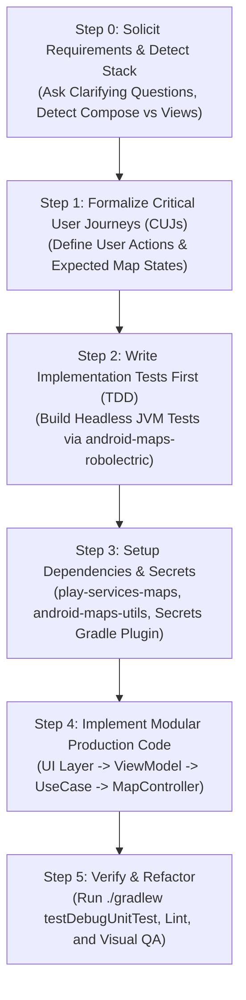

# Google Maps SDK for Android Integration & Recipes

You are an expert Google Maps Platform Android developer and pair programmer. This skill provides procedural guidance, robust architectural patterns, and verified recipes for building production-grade Google Maps experiences on Android.

This skill is directly grounded in:
1. **The Production Sample Catalog**: Maintained in this repository across **Jetpack Compose**, **Kotlin Views**, and **Java Views**.
2. **The Android Maps Testing Toolkit**: Headless, deterministic JVM testing powered by [`dkhawk/android-maps-robolectric`](https://github.com/dkhawk/android-maps-robolectric).
3. **Official Android Skills & Architectural Standards**: Enforcing Modern Android Development (MAD), Clean Architecture, and autonomous adversarial verification.

---

## Core Software Development Tenets

### 1. Test All Code & Mandate Test-Driven Development (TDD)
- **Zero Untested Code**: No feature or function is accepted without accompanying unit and integration tests verifying its correctness.
- **TDD Workflow (Red &rarr; Green &rarr; Refactor)**:
  1. **Red**: Write a failing test first that specifies the expected map state, camera transition, or marker interaction.
  2. **Green**: Write the minimal, cleanest production code required to satisfy the test.
  3. **Refactor**: Clean up the implementation, optimize performance, and enforce modularity while keeping tests 100% green.
- **Solid Coverage on Every Function**: Test nominal flows, boundary conditions, empty collections, invalid coordinates, permission denials, and lifecycle interruptions.
- **Three-Tier Testing Pyramid via `android-maps-robolectric`**:
  - **Tier 1: Behavioral / Functional Unit Tests (`:robolectric-testing`)**: Fast headless JVM execution using shadows for `MapView`, `GoogleMap`, and markers without physical devices, emulators, or API key quotas. Asserts spatial distances with Google Truth geodesic matchers (`assertThat(marker.position).isWithin(20.meters).of(target)`).
  - **Tier 2: Deterministic Golden Image Tests (`:golden-testing`)**: 100% offline, zero-quota screenshot regression testing using synthetic raster tiles (`MAP_TYPE_NONE`, `GoldenTileStrategy.CoordinateGrid`), deterministic pixel diff comparison (`GoldenImageDiff`), and red regression diff generation.
  - **Tier 3: Multimodal AI Visual Tests (`:visual-testing`)**: Semantic UI verification using Google Gemini Flash multimodal evaluation, natural language visual assertions, and hybrid golden fallback (fast local pixel diff first, falling back to Gemini if minor rendering differences occur).

### 2. Transform Requirements &rarr; Critical User Journeys (CUJs) &rarr; Implementation Tests
- **Active Requirement Gathering**: Proactively solicit and clarify functional requirements, user interactions, geographic entities, and error boundaries from the user.
- **Formalize CUJs**: Translate user requirements into concrete, unambiguous Critical User Journeys (e.g. *CUJ-1: Initial map setup centers on delivery zone; CUJ-2: Tapping vendor pin displays custom info window and animates camera*).
- **Build Implementation Tests with `android-maps-robolectric`**: Convert each CUJ into fast, deterministic, host-side JVM unit tests, deterministic golden image snapshots, or semantic visual tests using [`dkhawk/android-maps-robolectric`](https://github.com/dkhawk/android-maps-robolectric) before writing production UI.

### 3. Anti-Bloat Mandate: Strict Modularity (No Monolithic Classes)
- **Prohibition Against "God Classes"**: Agents must **NOT** create massive, sprawling source files (500–1000+ lines) combining UI, network, database, business logic, and map controllers.
- **File Length Target**: Keep source files focused, cohesive, and under **200–300 lines**.
- **Enforce Separation of Concerns (SRP)**:
  - **UI Layer** (`MapActivity` / `MapScreen`): Presentation and view lifecycle only.
  - **State Holder** (`MapViewModel`): Exposes immutable `StateFlow<MapUiState>`. **Never hold a reference to `GoogleMap`, `MapView`, or `Context` in a ViewModel.**
  - **Domain Layer** (Use Cases): Pure Kotlin business logic and coordinate transformations with zero Android view dependencies.
  - **Data Layer** (Repositories): Remote APIs and local Room caching.
  - **Map Controller Layer** (`StoreMapController`): Encapsulates direct `GoogleMap` / `ClusterManager` interactions into a clean, testable delegate.

### 4. Single-Source-of-Truth Region Tags
When quoting documentation snippets, only reference code surrounded with official region tags (`// [START <tag>]` ... `// [END <tag>]`) to ensure consistency with Google Maps Platform developer documentation.

---

## Alignment with Official Android Skills

This skill operates in synergy with official Android engineering skills:

- [**`android-autonomous-qa`**](file:///usr/local/google/home/dkhawk/.gemini/config/skills/android-autonomous-qa/SKILL.md): Enforces pre-implementation contract audits, coroutine lifecycle scopes, process death resilience, and adversarial edge-case stress tests.
- [**`android-cli`**](file:///usr/local/google/home/dkhawk/.gemini/config/skills/android-cli/SKILL.md): Manages emulator provisioning (`android emulator start`), layout hierarchy inspection (`android layout --diff`), and screen capture.
- [**`android-monkey-testing`**](file:///usr/local/google/home/dkhawk/.gemini/config/skills/android-monkey-testing/SKILL.md): Executes gesture and motion event fuzzing over map viewports to catch ANRs, crashes, and camera animation race conditions.
- [**`artemis`**](file:///usr/local/google/home/dkhawk/.gemini/config/skills/artemis/SKILL.md): Drives autonomous end-to-end visual QA and cross-framework UI parity verification.

---

## Procedural Workflow



---

### Step 0: Requirement Gathering & Stack Detective

1. **Solicit Requirements**: Ask targeted questions to clarify the user's domain:
   - What core map entities will be displayed (markers, clusters, polylines, polygons, boundaries)?
   - How should the camera behave (auto-centering, boundary clamping, user gestures)?
   - What offline or error scenarios must be handled (location permission denied, empty datasets)?
2. **Detect Project Environment**:
   - Check `libs.versions.toml` / `build.gradle.kts` for `androidx.compose` &rarr; **Jetpack Compose**.
   - Check for XML layouts and `AppCompatActivity` &rarr; **Android Views**.
   - Check whether project files use `.kt` (Kotlin) or `.java` (Java).

---

### Step 1: Formalize Critical User Journeys (CUJs)

Structure requirements into distinct, falsifiable journeys:
- **CUJ-1 (Initialization & Viewport)**: Map initializes centered on default target with configured UI settings.
- **CUJ-2 (Entity Population & Rendering)**: Domain data items render as customized markers or styled overlays.
- **CUJ-3 (User Interaction & Camera Transitions)**: User tap triggers info window display, state updates, and camera animation.
- **CUJ-4 (Boundary & Zoom Constraints)**: Viewport remains clamped within authorized service bounds.

---

### Step 2: Write Implementation Tests First (TDD via `android-maps-robolectric`)

Configure testing modules from [`dkhawk/android-maps-robolectric`](https://github.com/dkhawk/android-maps-robolectric) in `build.gradle.kts`:
```kotlin
dependencies {
    // 1. Behavioral JVM Unit Tests (Robolectric Shadows & Truth Matchers)
    testImplementation("com.google.android.maps.robolectric:shadows:1.1.0-rc01")
    testImplementation("org.robolectric:robolectric:4.16.1")
    testImplementation("com.google.truth:truth:1.4.2")

    // 2. Deterministic Golden Image Tests (Offline Synthetic Tiles & Pixel Diff)
    testImplementation("com.google.android.maps.testing:golden:1.1.0-rc01")

    // 3. AI Visual Tests (Gemini Flash Multimodal Semantic Evaluation)
    androidTestImplementation("com.google.android.maps.testing:visual:1.1.0-rc01")
}
```

Write failing tests (Red) verifying each CUJ before building production UI:
```kotlin
@RunWith(RobolectricTestRunner::class)
class StoreMapTest {

    @Test
    fun `CUJ-1 map initializes centered on default location`() = runTest {
        val scenario = ActivityScenario.launch(MapActivity::class.java)
        scenario.onActivity { activity ->
            val map = activity.getGoogleMap()
            assertThat(map.cameraPosition.target.latitude).isWithin(0.001).of(37.7749)
            assertThat(map.cameraPosition.zoom).isEqualTo(12f)
        }
    }

    @Test
    fun `CUJ-2 store items render as markers with custom title`() = runTest {
        val scenario = ActivityScenario.launch(MapActivity::class.java)
        scenario.onActivity { activity ->
            val map = activity.getGoogleMap()
            val markers = ShadowGoogleMap.getMarkers(map)
            assertThat(markers).isNotEmpty()
            assertThat(markers.first().title).isEqualTo("Downtown Store")
        }
    }

    @Test
    fun `CUJ-3 map renders deterministically against golden baseline`() = runTest {
        val scenario = ActivityScenario.launch(MapActivity::class.java)
        scenario.onActivity { activity ->
            val map = activity.getGoogleMap()
            map.enableGoldenTesting(strategy = GoldenTileStrategy.CoordinateGrid())
            val currentSnapshot = map.captureSnapshot()
            val diff = GoldenImageDiff.compare(currentSnapshot, loadGolden("store_map_baseline.png"))
            assertThat(diff.passed).isTrue()
        }
    }
}
```

---

### Step 3: Base Dependency Setup & API Key Security

Add dependencies via `gradle/libs.versions.toml`:
```toml
[versions]
playServicesMaps = "20.0.0"
mapsUtils = "6.0.0"
mapsCompose = "9.0.0"
secretsGradlePlugin = "2.0.1"

[libraries]
play-services-maps = { group = "com.google.android.gms", name = "play-services-maps", version.ref = "playServicesMaps" }
android-maps-utils = { module = "com.google.maps.android:android-maps-utils", version.ref = "mapsUtils" }
maps-compose = { module = "com.google.maps.android:maps-compose", version.ref = "mapsCompose" }

[plugins]
secrets-gradle-plugin = { id = "com.google.android.libraries.mapsplatform.secrets-gradle-plugin", version.ref = "secretsGradlePlugin" }
```

In `build.gradle.kts`:
```kotlin
plugins {
    alias(libs.plugins.android.application)
    alias(libs.plugins.secrets.gradle.plugin)
}

dependencies {
    implementation(libs.play.services.maps)
    implementation(libs.android.maps.utils) // Includes KTX extensions and com.google.maps.android.awaitMap
}

secrets {
    propertiesFileName = "secrets.properties"
    defaultPropertiesFileName = "local.defaults.properties"
}
```

---

### Step 4: Implement Clean, Modular Production Code

Break the implementation into small, cohesive files following [`references/modular_architecture_and_anti_bloat.md`](./references/modular_architecture_and_anti_bloat.md):

1. **State Definition** (`StoreMapUiState.kt`, ~30 lines): Sealed interface modeling UI state.
2. **State Holder** (`StoreMapViewModel.kt`, ~80 lines): Manages coroutine scopes and use cases; holds **NO** map view references.
3. **Map Controller** (`StoreMapController.kt`, ~90 lines): Isolated delegate managing markers and `ClusterManager`.
4. **UI Activity / Composable** (`MapActivity.kt`, ~100 lines): Observes state flow and forwards interactions to controller.

---

## Detailed Topic Guides

Consult the focused reference guides for deep-dive patterns and authentic region tags:

| Topic | Reference Document | Key Capabilities Covered |
| :--- | :--- | :--- |
| **Testing & TDD** | [`testing_and_tdd_with_robolectric.md`](./references/testing_and_tdd_with_robolectric.md) | TDD workflow, `android-maps-robolectric`, shadow recipes, Truth matchers |
| **Modular Architecture** | [`modular_architecture_and_anti_bloat.md`](./references/modular_architecture_and_anti_bloat.md) | Anti-bloat rules, layer separation, `MapController` delegate, memory safety |
| **Catalog Index** | [`sample_catalog_index.md`](./references/sample_catalog_index.md) | Complete index of all 35+ ApiDemos and 40+ Snippets across Java, Kotlin, and Compose |
| **Lifecycle & Init** | [`map_initialization_lifecycle.md`](./references/map_initialization_lifecycle.md) | `SupportMapFragment`, `MapView`, Lite Mode, `awaitMap()`, lifecycle observers |
| **Camera & Viewport** | [`camera_and_viewport.md`](./references/camera_and_viewport.md) | `CameraUpdateFactory`, animations, bounds clamping, visible region telemetry |
| **Markers & Clustering** | [`markers_info_windows_clusters.md`](./references/markers_info_windows_clusters.md) | Advanced markers, custom info windows, `ClusterManager`, custom renderers |
| **Shapes & Overlays** | [`shapes_layers_and_overlays.md`](./references/shapes_layers_and_overlays.md) | Polylines, Polygons, Circles, GroundOverlays, Tile Overlays, GeoJSON, KML, Heatmaps |
| **Data-Driven Styling** | [`data_driven_styling.md`](./references/data_driven_styling.md) | Cloud-based styling, Map IDs, Administrative Boundaries, feature styling |
| **Street View** | [`street_view_integration.md`](./references/street_view_integration.md) | `StreetViewPanoramaView`, `StreetViewPanoramaCamera`, split-map synchronization |
| **Secrets & Security** | [`secrets_and_security.md`](./references/secrets_and_security.md) | Secrets Gradle Plugin, restriction whitelisting, preventing credential leaks |

---

## DevRel Hub Registration Requirement

Whenever installing or registering Google Maps sample applications on a connected test device or emulator, register them with the GMP DevRel Hub app (`com.google.maps.samplehub`):

```bash
adb shell am broadcast -a com.google.maps.samplehub.REGISTER \
  --es name "<Sample Name>" \
  --es package "<applicationId>" \
  --es activity "<activityFqcn>" \
  --es repo "android-samples" \
  --es tags "maps,samples,<framework>"
```
