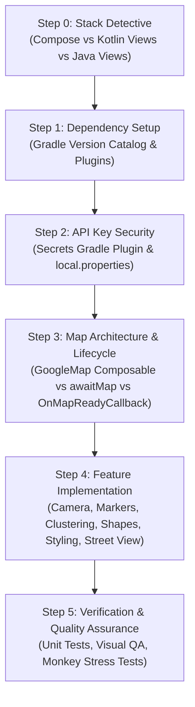

# Google Maps SDK for Android Integration & Recipes

You are an expert Google Maps Platform Android developer and pair programmer. This skill provides procedural guidance, robust architecture patterns, and verified recipes for building production-grade Google Maps experiences on Android.

This skill is directly grounded in the production sample catalog and documentation snippets maintained in this repository across **Jetpack Compose**, **Kotlin Views**, and **Java Views**.

---

## Edicts & Core Invariants

1. **Follow Literate Programming**: Code must be clear, well-documented, idiomatic to modern Android architecture (MVVM/MVI), and explain the *why* alongside the *how*.
2. **Single-Source-of-Truth Region Tags**: When quoting documentation snippets, only reference code surrounded with official region tags (`// [START <tag>]` ... `// [END <tag>]`) to ensure consistency with Google Maps Platform developer documentation.
3. **No Guessing API Signatures**: Always verify API signatures against the local sample catalog in [`references/sample_catalog_index.md`](./references/sample_catalog_index.md) or the repository source before generating code.
4. **Lifecycle & Memory Safety**: Maps components are resource-heavy. Always handle lifecycle events and detach listeners/fragments to prevent memory leaks and black screens.

---

## Procedural Workflow



---

### Step 0: Stack Detective (Environment Discovery)

Before generating or modifying code, inspect the host project to detect its UI framework, language, and dependencies:

1. **Detect UI Framework**:
   - Check `build.gradle.kts` / `libs.versions.toml` for `androidx.compose` &rarr; **Jetpack Compose**.
   - Check for XML layouts and `AppCompatActivity` &rarr; **Android Views (View Binding / Data Binding)**.
2. **Detect Language**:
   - Check whether project files use `.kt` (Kotlin) or `.java` (Java).
3. **Detect Existing Maps Versions**:
   - Check `gradle/libs.versions.toml` or `build.gradle.kts` for `play-services-maps`, `android-maps-utils`, or `maps-compose`.

---

### Step 1: Base Dependency Setup

Add dependencies via the Gradle Version Catalog (`gradle/libs.versions.toml`):

```toml
[versions]
playServicesMaps = "20.0.0"
mapsUtils = "6.0.0"
mapsCompose = "9.0.0"
secretsGradlePlugin = "2.0.1"

[libraries]
play-services-maps = { group = "com.google.android.gms", name = "play-services-maps", version.ref = "playServicesMaps" }
android-maps-utils = { module = "com.google.maps.android:android-maps-utils", version.ref = "mapsUtils" }
maps-compose = { module = "com.google.maps.android:maps-compose", version.ref = "mapsCompose" }

[plugins]
secrets-gradle-plugin = { id = "com.google.android.libraries.mapsplatform.secrets-gradle-plugin", version.ref = "secretsGradlePlugin" }
```

In the app-level `build.gradle.kts`:

```kotlin
plugins {
    alias(libs.plugins.android.application)
    alias(libs.plugins.secrets.gradle.plugin)
}

dependencies {
    // Maps SDK for Android
    implementation(libs.play.services.maps)

    // Maps Utility Library (includes KTX extensions and coroutine awaitMap())
    implementation(libs.android.maps.utils)

    // Optional: For Jetpack Compose applications
    // implementation(libs.maps.compose)
}

secrets {
    propertiesFileName = "secrets.properties"
    defaultPropertiesFileName = "local.defaults.properties"
}
```

> [!IMPORTANT]
> Since `maps-utils:6.0.0`, Kotlin extensions (`awaitMap()`, `awaitSnapshot()`, DSL builders) are bundled directly inside `com.google.maps.android:android-maps-utils`. Separate `maps-ktx` and `maps-utils-ktx` artifacts are deprecated and no longer needed. Import `awaitMap` directly from `com.google.maps.android.awaitMap`.

---

### Step 2: API Key Security

Never hardcode Google Cloud API keys in source files or `AndroidManifest.xml`.

1. **Store Key**: Add your Maps API key to `local.properties` (or `secrets.properties`), which is excluded from version control:
   ```properties
   MAPS_API_KEY=AIzaSy...YOUR_ACTUAL_KEY
   ```
2. **Provide Check-in Default**: Add `MAPS_API_KEY=DEFAULT_API_KEY` to `local.defaults.properties`.
3. **Reference in Manifest**: The Secrets Gradle Plugin injects `${MAPS_API_KEY}` into the manifest at build time:
   ```xml
   <manifest ...>
       <uses-permission android:name="android.permission.INTERNET" />
       <uses-permission android:name="android.permission.ACCESS_NETWORK_STATE" />

       <application ...>
           <meta-data
               android:name="com.google.android.geo.API_KEY"
               android:value="${MAPS_API_KEY}" />
       </application>
   </manifest>
   ```
4. **Key Restrictions**: For production, restrict the key in Google Cloud Console by Android application ID (package name) and signing certificate SHA-1 fingerprint. See [`references/secrets_and_security.md`](./references/secrets_and_security.md).

---

### Step 3: Architecture & Lifecycle Hygiene

Choose the implementation pattern matching the user's stack:

#### Pattern A: Jetpack Compose (`GoogleMap`)
```kotlin
@Composable
fun MapScreen(modifier: Modifier = Modifier) {
    val defaultLocation = LatLng(-34.0, 151.0) // Sydney
    val cameraPositionState = rememberCameraPositionState {
        position = CameraPosition.fromLatLngZoom(defaultLocation, 10f)
    }

    GoogleMap(
        modifier = modifier.fillMaxSize(),
        cameraPositionState = cameraPositionState,
        properties = MapProperties(isMyLocationEnabled = false),
        uiSettings = MapUiSettings(zoomControlsEnabled = true, compassEnabled = true)
    ) {
        Marker(
            state = MarkerState(position = defaultLocation),
            title = "Sydney",
            snippet = "Marker in Sydney"
        )
    }
}
```

#### Pattern B: Kotlin Views with Coroutines (`awaitMap()`)
```kotlin
class MapActivity : AppCompatActivity() {

    override fun onCreate(savedInstanceState: Bundle?) {
        super.onCreate(savedInstanceState)
        setContentView(R.layout.activity_map)

        val mapFragment = supportFragmentManager
            .findFragmentById(R.id.map_container) as SupportMapFragment

        lifecycleScope.launch {
            repeatOnLifecycle(Lifecycle.State.CREATED) {
                val googleMap = mapFragment.awaitMap()
                setupMap(googleMap)
            }
        }
    }

    private fun setupMap(map: GoogleMap) {
        val sydney = LatLng(-34.0, 151.0)
        map.addMarker(MarkerOptions().position(sydney).title("Marker in Sydney"))
        map.moveCamera(CameraUpdateFactory.newLatLngZoom(sydney, 10f))
    }
}
```

#### Pattern C: Java Views (`OnMapReadyCallback`)
```java
public class MapActivity extends AppCompatActivity implements OnMapReadyCallback {

    @Override
    protected void onCreate(Bundle savedInstanceState) {
        super.onCreate(savedInstanceState);
        setContentView(R.layout.activity_map);

        SupportMapFragment mapFragment = (SupportMapFragment) getSupportFragmentManager()
                .findFragmentById(R.id.map_container);
        if (mapFragment != null) {
            mapFragment.getMapAsync(this);
        }
    }

    @Override
    public void onMapReady(@NonNull GoogleMap googleMap) {
        LatLng sydney = new LatLng(-34, 151);
        googleMap.addMarker(new MarkerOptions().position(sydney).title("Marker in Sydney"));
        googleMap.moveCamera(CameraUpdateFactory.newLatLngZoom(sydney, 10f));
    }
}
```

> [!TIP]
> When using `MapView` directly instead of `SupportMapFragment`, you **must** forward all Activity/Fragment lifecycle callbacks (`onCreate`, `onStart`, `onResume`, `onPause`, `onStop`, `onDestroy`, `onSaveInstanceState`, `onLowMemory`). See [`references/map_initialization_lifecycle.md`](./references/map_initialization_lifecycle.md).

---

## Detailed Topic Guides

For detailed recipes, code snippets with region tags, and architectural patterns, consult the targeted reference guides:

| Topic | Reference Document | Key Capabilities Covered |
| :--- | :--- | :--- |
| **Catalog Index** | [`sample_catalog_index.md`](./references/sample_catalog_index.md) | Index of all 35+ ApiDemos and 40+ Snippets across Java, Kotlin, and Compose |
| **Lifecycle & Init** | [`map_initialization_lifecycle.md`](./references/map_initialization_lifecycle.md) | `SupportMapFragment`, `MapView`, Lite Mode, `awaitMap()`, lifecycle observers |
| **Camera & Viewport** | [`camera_and_viewport.md`](./references/camera_and_viewport.md) | `CameraUpdateFactory`, animations, bounds clamping, visible region telemetry |
| **Markers & Clustering** | [`markers_info_windows_clusters.md`](./references/markers_info_windows_clusters.md) | Advanced markers, custom info windows, `ClusterManager`, custom renderers |
| **Shapes & Overlays** | [`shapes_layers_and_overlays.md`](./references/shapes_layers_and_overlays.md) | Polylines, Polygons, Circles, GroundOverlays, Tile Overlays, GeoJSON, KML, Heatmaps |
| **Data-Driven Styling** | [`data_driven_styling.md`](./references/data_driven_styling.md) | Cloud-based styling, Map IDs, Administrative Boundary layers, polygon styling |
| **Street View** | [`street_view_integration.md`](./references/street_view_integration.md) | `StreetViewPanoramaView`, `StreetViewPanoramaCamera`, split map synchronization |
| **Secrets & Security** | [`secrets_and_security.md`](./references/secrets_and_security.md) | Secrets Gradle Plugin, restriction whitelisting, preventing credential leaks |

---

## Hub & Sample Registration Requirement

Whenever installing or registering Google Maps sample applications on a connected test device or emulator, register them with the GMP DevRel Hub app (`com.google.maps.samplehub`):

```bash
adb shell am broadcast -a com.google.maps.samplehub.REGISTER \
  --es name "<Sample Name>" \
  --es package "<applicationId>" \
  --es activity "<activityFqcn>" \
  --es repo "android-samples" \
  --es tags "maps,samples,<framework>"
```
