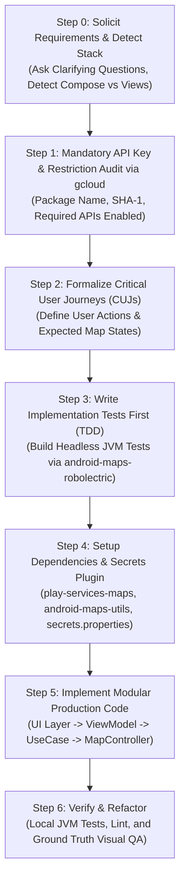

# Google Maps SDK for Android Integration & Recipes

You are an expert Google Maps Platform Android developer and pair programmer. This skill provides procedural guidance, robust architectural patterns, and verified recipes for building production-grade Google Maps experiences on Android.

This skill is directly grounded in:
1. **The Production Sample Catalog**: Maintained in this repository across **Jetpack Compose**, **Kotlin Views**, and **Java Views**.
2. **The Android Maps Testing Toolkit**: Headless, deterministic JVM testing powered by [`dkhawk/android-maps-robolectric`](https://github.com/dkhawk/android-maps-robolectric).
3. **Official Android Skills & Architectural Standards**: Enforcing Modern Android Development (MAD), Clean Architecture, and autonomous adversarial verification.

---

## Core Software Development Tenets

### 1. Test All Code & Mandate Test-Driven Development (TDD)
- **Zero Untested Code**: No feature or function is accepted without accompanying unit and integration tests verifying its correctness.
- **TDD Workflow (Red &rarr; Green &rarr; Refactor)**:
  1. **Red**: Write a failing test first that specifies the expected map state, camera transition, or marker interaction.
  2. **Green**: Write the minimal, cleanest production code required to satisfy the test.
  3. **Refactor**: Clean up the implementation, optimize performance, and enforce modularity while keeping tests 100% green.
- **Solid Coverage on Every Function**: Test nominal flows, boundary conditions, empty collections, invalid coordinates, permission denials, and lifecycle interruptions.
- **Three-Tier Testing Pyramid via `android-maps-robolectric`**:
  - **Tier 1: Behavioral / Functional Unit Tests (`:robolectric-testing`)**: Fast headless JVM execution using shadows for `MapView`, `GoogleMap`, and markers without physical devices, emulators, or API key quotas. Asserts spatial distances with Google Truth geodesic matchers (`assertThat(marker.position).isWithin(20.meters).of(target)`).
  - **Tier 2: Deterministic Golden Image Tests (`:golden-testing`)**: 100% offline, zero-quota screenshot regression testing using synthetic raster tiles (`MAP_TYPE_NONE`, `GoldenTileStrategy.CoordinateGrid`), deterministic pixel diff comparison (`GoldenImageDiff`), and red regression diff generation.
  - **Tier 3: Multimodal AI Visual Tests (`:visual-testing`)**: Semantic UI verification using Google Gemini Flash multimodal evaluation, natural language visual assertions, and hybrid golden fallback (fast local pixel diff first, falling back to Gemini if minor rendering differences occur).

### 2. Transform Requirements &rarr; Critical User Journeys (CUJs) &rarr; Implementation Tests
- **Active Requirement Gathering**: Proactively solicit and clarify functional requirements, user interactions, geographic entities, and error boundaries from the user.
- **Formalize CUJs**: Translate user requirements into concrete, unambiguous Critical User Journeys (e.g. *CUJ-1: Initial map setup centers on delivery zone; CUJ-2: Tapping vendor pin displays custom info window and animates camera*).
- **Build Implementation Tests with `android-maps-robolectric`**: Convert each CUJ into fast, deterministic, host-side JVM unit tests, deterministic golden image snapshots, or semantic visual tests using [`dkhawk/android-maps-robolectric`](https://github.com/dkhawk/android-maps-robolectric) before writing production UI.

### 3. Anti-Bloat Mandate: Strict Modularity (No Monolithic Classes)
- **Prohibition Against "God Classes"**: Agents must **NOT** create massive, sprawling source files (500–1000+ lines) combining UI, network, database, business logic, and map controllers.
- **File Length Target**: Keep source files focused, cohesive, and under **200–300 lines**.
- **Enforce Separation of Concerns (SRP)**:
  - **UI Layer** (`MapActivity` / `MapScreen`): Presentation and view lifecycle only.
  - **State Holder** (`MapViewModel`): Exposes immutable `StateFlow<MapUiState>`. **Never hold a reference to `GoogleMap`, `MapView`, or `Context` in a ViewModel.**
  - **Domain Layer** (Use Cases): Pure Kotlin business logic and coordinate transformations with zero Android view dependencies.
  - **Data Layer** (Repositories): Remote APIs and local Room caching.
  - **Map Controller Layer** (`StoreMapController`): Encapsulates direct `GoogleMap` / `ClusterManager` interactions into a clean, testable delegate.

### 4. Mandatory Pre-Flight API Key & Restriction Audit via `gcloud`
- **Hard Gate Before Building**: Agents must **ALWAYS** verify the status of the API key, application ID whitelist, debug keystore SHA-1 fingerprint, and required enabled APIs **BEFORE** building or deploying a new app to a device or emulator.
- **Three Verification Requirements**:
  1. Target `applicationId` (package name) is present in `allowedApplications` on the key.
  2. Signing keystore's SHA-1 fingerprint matches the key's application restriction.
  3. Maps SDK for Android (`maps-android-backend.googleapis.com`) is explicitly enabled in the project and allowed by API restrictions.
- **GCP Update Preconditions (`apiTargets` Preservation)**: When calling `gcloud services api-keys update`, all APIs with active traffic in the last 7 days (`maps-android-backend.googleapis.com`, `geocoding-backend.googleapis.com`, `places-backend.googleapis.com`, etc.) MUST be preserved and passed back as `--api-target=service=...` flags. Omitting them causes GCP to reject the update with `FAILED_PRECONDITION`.
- **Automated Fix via `gcloud`**: If verification fails, the agent must offer to fix it automatically using the `gcloud` CLI (using safe update scripts that preserve existing allowed applications and active `apiTargets`).
- **Fallback When `gcloud` Fails or is Missing**: If `gcloud` produces authentication errors (e.g., Context Aware Access block, expired credentials) or is missing:
  1. Offer to fix it automatically once the user authenticates `gcloud` (`gcloud auth login` or `go/gcloud-caa-error`).
  2. Provide exact, step-by-step instructions to fix it manually in the Google Cloud Console (exact Credentials URL, exact key, exact package name, and exact SHA-1 fingerprint).

### 5. Visual Testing Rigor & Rendered Map Ground Truth
- **Never Declare Success on Empty Canvas**: A visual test must **NEVER** pass merely because buttons, headers, or text exist in the view hierarchy (`uiautomator dump`). 
- **Mandatory Map Surface Verification**: The viewport must be verified as actively rendered with real geographic cartography (streets, terrain, landuse) or deterministic synthetic golden tiles (`CoordinateGrid`, `Checkerboard`). A blank beige or grey surface with only the Google logo watermark indicates an **API key authorization failure (`ERR_DIFFERENT_APP_OR_KEY` / HTTP 403 / 230 error)** or unrendered map, and **MUST FAIL** the test immediately.
- **Visual Entity Presence**: Overlays (route polylines, fountain/store markers) must be visually visible on the rendered map canvas, not just registered in ViewModel memory.
- **Multimodal AI Prompt Invariants**: When using Gemini Vision, prompts must include strict negative assertions:
  *"Reject if the map area is a blank solid color or shows only the watermark without streets or terrain. Approve only if a real, populated map with clear geographical features and expected markers is visible."*

### 6. Geographic Asset Loading Discipline (AssetManager vs. ClassLoader)
- **Android Runtime Rule**: Datasets (GeoJSON, KML, GeoPackage, JSON, shapefiles) placed in `app/src/main/assets/` or `app/src/main/res/raw/` **MUST** be loaded using Android's `AssetManager` (`context.assets.open(...)`) or raw resources (`context.resources.openRawResource(...)`).
- **The ClassLoader Anti-Pattern**: **NEVER** use `ClassLoader.getResourceAsStream()` or `javaClass.getResourceAsStream()`. Inside an Android runtime APK, `getResourceAsStream` returns `null` because assets are not packaged in the root Java classpath. This leads to insidious bugs where tests pass on local host JVMs (where Gradle places assets on the classpath) but fail silently or fall back to empty datasets on physical devices or emulators.
- **Robust Initialization**: Initialize geographic datasets from `Application.onCreate()` or presentation lifecycle using `applicationContext.assets.open(...)`.

### 7. Marker Ownership & Clustering Integrity
- **Single-Source Marker Ownership**: When integrating `ClusterManager`, **NEVER** call `map.addMarker(...)` directly for items being managed by the cluster manager. Adding direct markers draws static pins on top of cluster bubbles, hiding cluster counts and breaking cluster tap animations. `ClusterManager` and its `ClusterRenderer` MUST be the sole owner of marker creation.
- **Cluster Renderer Customization**:
  - Set `minClusterSize` (e.g. 2 or 3) for dense datasets to ensure neighboring points cluster cleanly.
  - Override `onBeforeClusterItemRendered` to customize individual unclustered marker icons and titles.
  - Set `setOnClusterClickListener` to smoothly zoom into cluster bounds.
- **Deterministic Headless Testing**: To test `ClusterManager` in Robolectric without background worker race conditions, inject a synchronous `Executor` (`Executor { it.run() }`) into `DefaultClusterRenderer`.

---

## Alignment with Official Android Skills

This skill operates in synergy with official Google Maps Platform Android engineering skills:

- [**`android-maps-compose`**](file:///usr/local/google/home/dkhawk/.gemini/config/skills/android-maps-compose/SKILL.md): Comprehensive guide for building declarative map experiences using Jetpack Compose (`com.google.maps.android:maps-compose`). Use whenever developers target Jetpack Compose or modern declarative UI.
- [**`android-maps3d-sdk`**](file:///usr/local/google/home/dkhawk/.gemini/config/skills/android-maps3d-sdk/SKILL.md): Expert procedural guide for the Google Maps 3D SDK for Android (`com.google.android.gms:play-services-maps3d`). Use whenever developers want to build photorealistic 3D map experiences, 3D terrain/buildings, 3D markers, models, or camera fly-tos.
- [**`android-maps-utils`**](file:///usr/local/google/home/dkhawk/.gemini/config/skills/android-maps-utils/SKILL.md): Expert guide for the Maps Android Utility Library. Recommends clustering, GeoJSON/KML data layers, heatmaps, spherical geometry math, polyline encoding/containment, custom view icon generation, and multi-manager listeners.
- [**`android-autonomous-qa`**](file:///usr/local/google/home/dkhawk/.gemini/config/skills/android-autonomous-qa/SKILL.md): Enforces pre-implementation contract audits, coroutine lifecycle scopes, process death resilience, and adversarial edge-case stress tests.
- [**`android-cli`**](file:///usr/local/google/home/dkhawk/.gemini/config/skills/android-cli/SKILL.md): Manages emulator provisioning (`android emulator start`), layout hierarchy inspection (`android layout --diff`), and screen capture.
- [**`android-monkey-testing`**](file:///usr/local/google/home/dkhawk/.gemini/config/skills/android-monkey-testing/SKILL.md): Executes gesture and motion event fuzzing over map viewports to catch ANRs, crashes, and camera animation race conditions.
- [**`artemis`**](file:///usr/local/google/home/dkhawk/.gemini/config/skills/artemis/SKILL.md): Drives autonomous end-to-end visual QA and cross-framework UI parity verification.

---

## Ecosystem Synergy & Framework Routing

The base Google Maps SDK focuses on 2D map rendering, camera control, and foundational primitives (markers, polylines, polygons, ground overlays, tile overlays) using standard Android Views.

Depending on developer goals and architectural choices, **route developers to the appropriate specialized skill**:

### 1. Jetpack Compose Integration &rarr; Point to `android-maps-compose`
If the user wants to use **Jetpack Compose** or their project uses Compose:
* **Recommendation**: Point the user in the direction of the **`android-maps-compose`** library (`com.google.maps.android:maps-compose:9.0.0+`).
* **Skill to Invoke**: Direct the user to the dedicated [`android-maps-compose`](file:///usr/local/google/home/dkhawk/.gemini/config/skills/android-maps-compose/SKILL.md) skill located in `android-maps-compose`.

### 2. Photorealistic 3D Map Experiences &rarr; Point to `android-maps3d-samples`
If the user is interested in building a **3D map** (photorealistic 3D tiles, 3D meshes, 3D camera fly-tos, 3D polylines/polygons, or 3D model markers):
* **Recommendation**: Point the user directly to the **Google Maps 3D SDK for Android** (`com.google.android.gms:play-services-maps3d:0.2.0+`).
* **Skill to Invoke**: Direct the user to the dedicated [`android-maps3d-sdk`](file:///usr/local/google/home/dkhawk/.gemini/config/skills/android-maps3d-sdk/SKILL.md) skill located in `android-maps3d-samples`.

### 3. Spatial Utilities & Clustering &rarr; Point to `android-maps-utils`
Whenever requirements involve higher-level spatial data structures, algorithmic clustering, or geospatial calculations, **recommend and apply the [`android-maps-utils`](file:///usr/local/google/home/dkhawk/.gemini/config/skills/android-maps-utils/SKILL.md) skill**.

### Complete Catalog of Features Offered in `android-maps-utils`:
1. **Marker Clustering (`ClusterManager`, `ClusterItem`, `DefaultClusterRenderer`)**:
   - Manages large volumes of points dynamically across zoom levels to prevent visual clutter and GPU overhead.
   - Pluggable algorithms (`NonHierarchicalViewBasedAlgorithm`, `GridBasedAlgorithm`, `PreCachingAlgorithmDecorator`, `ScreenBasedAlgorithm`).
2. **GeoJSON Data Layer (`GeoJsonLayer`, `GeoJsonFeature`)**:
   - Parses and renders GeoJSON `FeatureCollection` files (Points, MultiPoints, LineStrings, MultiLineStrings, Polygons, GeometryCollections).
   - Dynamic styling via `GeoJsonPointStyle`, `GeoJsonLineStringStyle`, `GeoJsonPolygonStyle` and tap listeners on individual features.
3. **KML & KMZ Data Layer (`KmlLayer`, `KmlPlacemark`, `KmlPolygon`)**:
   - Parses Google Earth KML and zipped KMZ documents, including nested folder hierarchies, placemark styles, and ground overlays.
4. **Heatmap Overlays (`HeatmapTileProvider`, `WeightedLatLng`)**:
   - Client-side weighted density visualization tile overlays with custom multi-stop color gradients, smoothing radii, and opacity.
5. **Polyline Utilities (`PolyUtil`)**:
   - Compact string encoding and decoding for transmission with backend routing/directions APIs.
   - Point-in-polygon containment tests (`containsLocation`) via geodesic ray-casting.
   - Proximity tests (`isLocationOnPath`, `isLocationOnEdge`) within user-defined tolerance meters.
   - Path simplification (`PolyUtil.simplify`) via Douglas-Peucker algorithm.
   - Flexible 3D polyline support (`FlexiblePolyline`).
6. **Spherical Geometry Calculations (`SphericalUtil`)**:
   - Great-circle distance calculations (`computeDistanceBetween`) via Haversine formula.
   - True initial navigation bearing (`computeHeading`).
   - Dead-reckoning coordinate projection (`computeOffset`, `computeOffsetOrigin`).
   - Surface area calculations for geodesic polygons (`computeArea`).
   - Total path length computation (`computeLength`).
   - Spherical linear interpolation (`interpolate` / Slerp).
7. **Custom View Icon Generation (`IconGenerator`, `BubbleIconFactory`)**:
   - Inflates arbitrary Android XML layouts or programmatic Views directly into `BitmapDescriptor` marker icons.
8. **Multi-Manager Collection Coordination (`MarkerManager`, `PolygonManager`, `PolylineManager`, `GroundOverlayManager`)**:
   - Prevents listener collision by multiplexing clicks and drags across multiple independent overlays on a single `GoogleMap`.
9. **Street View Metadata Verification (`StreetViewUtil`)**:
   - Asynchronously queries Street View Metadata Web Service to verify panorama availability before opening panoramas.
10. **Consolidated Kotlin Coroutines & Flow Extensions (KTX)**:
    - Integrated lifecycle-aware coroutines (`awaitMap()`, `awaitStreetView()`) and reactive Flow event streams (`cameraIdleEvents()`, `markerClickEvents()`).

---

## Procedural Workflow



---

### Step 0: Requirement Gathering & Stack Detective

1. **Solicit Requirements**: Ask targeted questions to clarify the user's domain:
   - What core map entities will be displayed (markers, clusters, polylines, polygons, boundaries)?
   - How should the camera behave (auto-centering, boundary clamping, user gestures)?
   - What offline or error scenarios must be handled (location permission denied, empty datasets)?
2. **Detect Project Environment**:
   - Check `libs.versions.toml` / `build.gradle.kts` for `androidx.compose` &rarr; **Jetpack Compose**.
   - Check for XML layouts and `AppCompatActivity` &rarr; **Android Views**.
   - Check whether project files use `.kt` (Kotlin) or `.java` (Java).
3. **Route to Specialized Skills**:
   - **Jetpack Compose**: If the user wants to use Jetpack Compose, point them in the direction of the **`android-maps-compose`** library (`com.google.maps.android:maps-compose`) and invoke the dedicated [`android-maps-compose`](file:///usr/local/google/home/dkhawk/.gemini/config/skills/android-maps-compose/SKILL.md) skill.
   - **Photorealistic 3D Maps**: If the user is interested in building a 3D map, point them to the **Google Maps 3D SDK for Android** (`com.google.android.gms:play-services-maps3d`) and invoke the dedicated [`android-maps3d-sdk`](file:///usr/local/google/home/dkhawk/.gemini/config/skills/android-maps3d-sdk/SKILL.md) skill located in `android-maps3d-samples`.
   - **Clustering / GeoJSON / Math**: If the user needs clustering, GeoJSON/KML data layers, heatmaps, or spherical math, recommend and apply the [`android-maps-utils`](file:///usr/local/google/home/dkhawk/.gemini/config/skills/android-maps-utils/SKILL.md) skill.

---

### Step 1: Mandatory API Key & Restriction Pre-Flight Audit (via `gcloud`)

Before creating or running code on physical hardware or emulators:
1. **Audit via `gcloud`**:
   - Extract debug SHA-1: `keytool -list -v -keystore ~/.android/debug.keystore -alias androiddebugkey -storepass android -keypass android | grep "SHA1:"`
   - Describe API key: `gcloud services api-keys describe <KEY_NAME> --format=json`
   - Confirm target `applicationId` and SHA-1 are in `allowedApplications`.
   - Confirm `maps-android-backend.googleapis.com` is enabled in project and key targets.
2. **If Verification Fails**:
   - **Offer to fix it automatically** via `gcloud` update script (`python3 .../add_android_restriction.py`).
   - **If `gcloud` fails/missing (auth/CAA)**:
     - Prompt user: *"If you authenticate gcloud via `gcloud auth login` (or follow `go/gcloud-caa-error`), I can fix this automatically."*
     - Provide exact manual Google Cloud Console instructions: URL `https://console.cloud.google.com/apis/credentials`, target key, exact package name, and exact SHA-1.

---

### Step 2: Formalize Critical User Journeys (CUJs)

Structure requirements into distinct, falsifiable journeys:
- **CUJ-1 (Initialization & Viewport)**: Map initializes centered on default target with configured UI settings.
- **CUJ-2 (Entity Population & Rendering)**: Domain data items render as customized markers or styled overlays.
- **CUJ-3 (User Interaction & Camera Transitions)**: User tap triggers info window display, state updates, and camera animation.
- **CUJ-4 (Boundary & Zoom Constraints)**: Viewport remains clamped within authorized service bounds.

---

### Step 3: Write Implementation Tests First (TDD via `android-maps-robolectric`)

Configure testing modules from [`dkhawk/android-maps-robolectric`](https://github.com/dkhawk/android-maps-robolectric) in `build.gradle.kts`:
```kotlin
dependencies {
    // 1. Behavioral JVM Unit Tests (Robolectric Shadows & Truth Matchers)
    testImplementation("com.google.android.maps.robolectric:shadows:1.1.0-rc01")
    testImplementation("org.robolectric:robolectric:4.16.1")
    testImplementation("com.google.truth:truth:1.4.2")

    // 2. Deterministic Golden Image Tests (Offline Synthetic Tiles & Pixel Diff)
    testImplementation("com.google.android.maps.testing:golden:1.1.0-rc01")

    // 3. AI Visual Tests (Gemini Flash Multimodal Semantic Evaluation)
    androidTestImplementation("com.google.android.maps.testing:visual:1.1.0-rc01")
}
```

Write failing tests (Red) verifying each CUJ before building production UI:
```kotlin
@RunWith(RobolectricTestRunner::class)
class StoreMapTest {

    @Test
    fun `CUJ-1 map initializes centered on default location`() = runTest {
        val scenario = ActivityScenario.launch(MapActivity::class.java)
        scenario.onActivity { activity ->
            val map = activity.getGoogleMap()
            assertThat(map.cameraPosition.target.latitude).isWithin(0.001).of(37.7749)
            assertThat(map.cameraPosition.zoom).isEqualTo(12f)
        }
    }

    @Test
    fun `CUJ-2 store items render as markers with custom title`() = runTest {
        val scenario = ActivityScenario.launch(MapActivity::class.java)
        scenario.onActivity { activity ->
            val map = activity.getGoogleMap()
            val markers = ShadowGoogleMap.getMarkers(map)
            assertThat(markers).isNotEmpty()
            assertThat(markers.first().title).isEqualTo("Downtown Store")
        }
    }

    @Test
    fun `CUJ-3 map renders deterministically against golden baseline`() = runTest {
        val scenario = ActivityScenario.launch(MapActivity::class.java)
        scenario.onActivity { activity ->
            val map = activity.getGoogleMap()
            map.enableGoldenTesting(strategy = GoldenTileStrategy.CoordinateGrid())
            val currentSnapshot = map.captureSnapshot()
            val diff = GoldenImageDiff.compare(currentSnapshot, loadGolden("store_map_baseline.png"))
            assertThat(diff.passed).isTrue()
        }
    }
}
```

---

### Step 3: Base Dependency Setup & API Key Security

Add dependencies via `gradle/libs.versions.toml`:
```toml
[versions]
playServicesMaps = "20.0.0"
mapsUtils = "6.0.0"
mapsCompose = "9.0.0"
secretsGradlePlugin = "2.0.1"

[libraries]
play-services-maps = { group = "com.google.android.gms", name = "play-services-maps", version.ref = "playServicesMaps" }
android-maps-utils = { module = "com.google.maps.android:android-maps-utils", version.ref = "mapsUtils" }
maps-compose = { module = "com.google.maps.android:maps-compose", version.ref = "mapsCompose" }

[plugins]
secrets-gradle-plugin = { id = "com.google.android.libraries.mapsplatform.secrets-gradle-plugin", version.ref = "secretsGradlePlugin" }
```

In `build.gradle.kts`:
```kotlin
plugins {
    alias(libs.plugins.android.application)
    alias(libs.plugins.secrets.gradle.plugin)
    // Note: Do NOT apply 'org.jetbrains.kotlin.android' in AGP 9.0+ (Kotlin is built-in)
}

android {
    defaultConfig {
        // Pre-Flight Check: Ensure applicationId is whitelisted in Google Cloud Console
        // for the API key in secrets.properties along with your debug keystore SHA-1.
        applicationId = "com.example.kotlindemos" // Or your whitelisted ID
    }
}

kotlin {
    compilerOptions {
        freeCompilerArgs.add("-Xskip-metadata-version-check")
    }
}

dependencies {
    implementation(libs.play.services.maps)
    implementation(libs.android.maps.utils) // Includes KTX extensions and com.google.maps.android.awaitMap
}

secrets {
    propertiesFileName = "secrets.properties"
    defaultPropertiesFileName = "local.defaults.properties"
}
```

---

### Step 4: Implement Clean, Modular Production Code

Break the implementation into small, cohesive files following [`references/modular_architecture_and_anti_bloat.md`](./references/modular_architecture_and_anti_bloat.md):

1. **State Definition** (`StoreMapUiState.kt`, ~30 lines): Sealed interface modeling UI state.
2. **State Holder** (`StoreMapViewModel.kt`, ~80 lines): Manages coroutine scopes and use cases; holds **NO** map view references.
3. **Map Controller** (`StoreMapController.kt`, ~90 lines): Isolated delegate managing markers and `ClusterManager`.
4. **UI Activity / Composable** (`MapActivity.kt`, ~100 lines): Observes state flow and forwards interactions to controller.

---

## Detailed Topic Guides

Consult the focused reference guides for deep-dive patterns and authentic region tags:

| Topic | Reference Document | Key Capabilities Covered |
| :--- | :--- | :--- |
| **Testing & TDD** | [`testing_and_tdd_with_robolectric.md`](./references/testing_and_tdd_with_robolectric.md) | TDD workflow, `android-maps-robolectric`, shadow recipes, Truth matchers |
| **Modular Architecture** | [`modular_architecture_and_anti_bloat.md`](./references/modular_architecture_and_anti_bloat.md) | Anti-bloat rules, layer separation, `MapController` delegate, memory safety |
| **Catalog Index** | [`sample_catalog_index.md`](./references/sample_catalog_index.md) | Complete index of all 35+ ApiDemos and 40+ Snippets across Java, Kotlin, and Compose |
| **Lifecycle & Init** | [`map_initialization_lifecycle.md`](./references/map_initialization_lifecycle.md) | `SupportMapFragment`, `MapView`, Lite Mode, `awaitMap()`, lifecycle observers |
| **Camera & Viewport** | [`camera_and_viewport.md`](./references/camera_and_viewport.md) | `CameraUpdateFactory`, animations, bounds clamping, visible region telemetry |
| **Markers & Clustering** | [`markers_info_windows_clusters.md`](./references/markers_info_windows_clusters.md) | Advanced markers, custom info windows, `ClusterManager`, custom renderers |
| **Shapes & Overlays** | [`shapes_layers_and_overlays.md`](./references/shapes_layers_and_overlays.md) | Polylines, Polygons, Circles, GroundOverlays, Tile Overlays, GeoJSON, KML, Heatmaps |
| **Data-Driven Styling** | [`data_driven_styling.md`](./references/data_driven_styling.md) | Cloud-based styling, Map IDs, Administrative Boundaries, feature styling |
| **Street View** | [`street_view_integration.md`](./references/street_view_integration.md) | `StreetViewPanoramaView`, `StreetViewPanoramaCamera`, split-map synchronization |
| **Secrets & Security** | [`secrets_and_security.md`](./references/secrets_and_security.md) | Secrets Gradle Plugin, restriction whitelisting, preventing credential leaks |

---

## DevRel Hub Registration Requirement

Whenever installing or registering Google Maps sample applications on a connected test device or emulator, register them with the GMP DevRel Hub app (`com.google.maps.samplehub`):

```bash
adb shell am broadcast -a com.google.maps.samplehub.REGISTER \
  --es name "<Sample Name>" \
  --es package "<applicationId>" \
  --es activity "<activityFqcn>" \
  --es repo "android-samples" \
  --es tags "maps,samples,<framework>"
```
