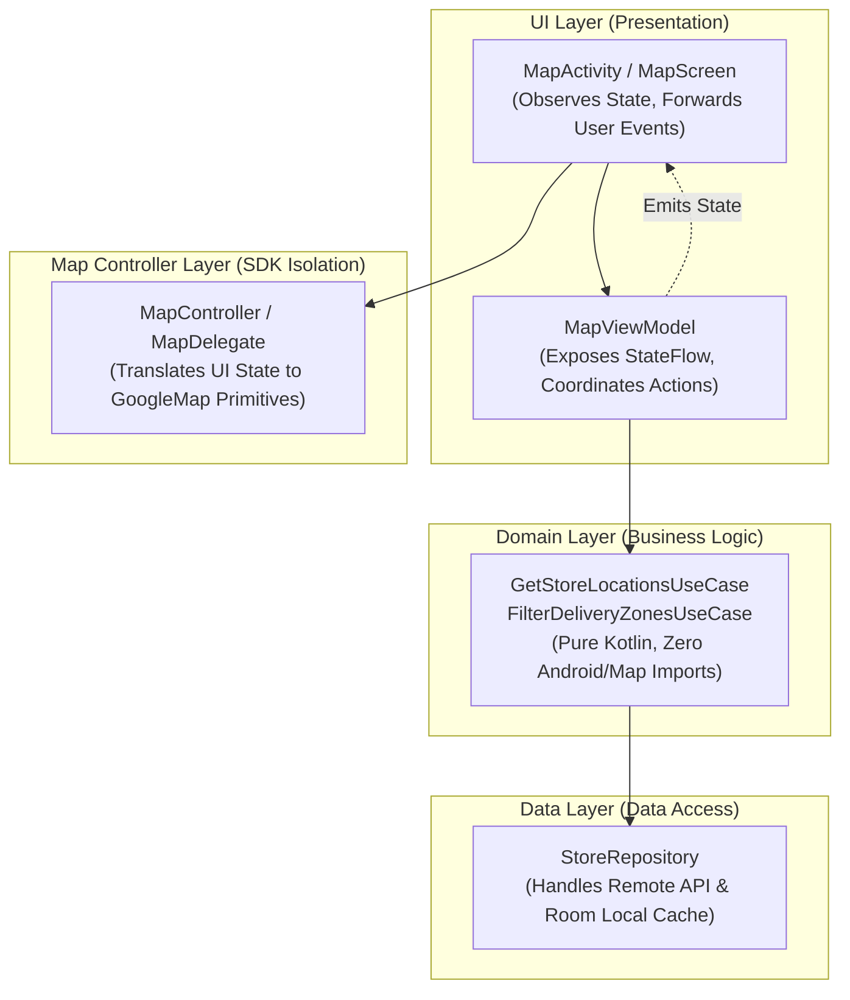

# Modular Architecture & Anti-Bloat Guidelines

This guide establishes the architectural principles and structural constraints for building maintainable, testable, and cleanly modularized Google Maps Android applications.

---

## 1. The Anti-Bloat Mandate: No Monolithic Files

> [!CAUTION]
> **Strict Prohibition Against Monolithic "God Classes"**:  
> Agents tend to dump all map setup, marker rendering, network fetching, business rules, and UI listeners into a single massive Activity or Fragment spanning 500–1000+ lines. **DO NOT DO THIS.**  
> Monolithic classes violate the Single Responsibility Principle (SRP), make unit testing impossible without full device emulators, and degrade code maintainability.

### Structural Guidelines
- **File Length Target**: Keep source files focused, cohesive, and under **200–300 lines**.
- **One Primary Class Per File**: Avoid stacking multiple large classes, enums, and utility extensions in a single file.
- **Extract Composables and Delegates**: Break complex UI into smaller, reusable composable functions or view delegates.

---

## 2. Standard Modern Android Architecture (MAD) Layering

Separate your application into distinct, unidirectional layers:



---

## 3. Layer Separation of Concerns

### A. UI Layer (`MapActivity` / `MapScreen`)
- **Role**: Pure presentation and lifecycle management.
- **Responsibilities**:
  - Initializes `SupportMapFragment`, `MapView`, or `GoogleMap` composable.
  - Collects `StateFlow` from `MapViewModel` within `repeatOnLifecycle`.
  - Forwards user touch/click events to the ViewModel.
- **Strict Invariants**:
  - NO network calls or database queries.
  - NO raw business logic or distance calculations (delegate to Domain/Use Cases).

### B. State Holder (`MapViewModel`)
- **Role**: Maintains UI state and processes user actions.
- **Responsibilities**:
  - Exposes an immutable `StateFlow<MapUiState>` (e.g. loading, list of items, selected marker, camera bounds).
  - Coordinates domain use cases.
- **Strict Invariants**:
  - **NEVER hold a reference to `GoogleMap`, `MapView`, or `Context` in a ViewModel!** Doing so causes immediate memory leaks across configuration changes.
  - ViewModels work strictly with domain models and pure data structures (e.g., `LatLng`, custom domain objects).

```kotlin
// Example Clean ViewModel
class StoreMapViewModel(
    private val getStoresUseCase: GetStoresUseCase
) : ViewModel() {

    private val _uiState = MutableStateFlow<StoreMapUiState>(StoreMapUiState.Loading)
    val uiState: StateFlow<StoreMapUiState> = _uiState.asStateFlow()

    fun loadStores() {
        viewModelScope.launch {
            try {
                val stores = getStoresUseCase()
                _uiState.value = StoreMapUiState.Success(
                    stores = stores,
                    cameraTarget = LatLng(37.7749, -122.4194)
                )
            } catch (e: Exception) {
                _uiState.value = StoreMapUiState.Error(e.message ?: "Failed to load stores")
            }
        }
    }
}
```

### C. Map Controller Layer (`MapController`)
- **Role**: Encapsulates direct `GoogleMap` interactions.
- **Responsibilities**:
  - Renders markers, polylines, or polygons from the provided state.
  - Manages `ClusterManager` and custom renderers.
  - Encapsulates camera animations and bounds calculations.
- **Benefits**:
  - Allows isolating `GoogleMap` calls into a testable unit.
  - Keeps the Activity thin and declarative.

```kotlin
class StoreMapController(
    private val context: Context,
    private val map: GoogleMap
) {
    private val clusterManager = ClusterManager<StoreClusterItem>(context, map)

    fun renderStores(stores: List<Store>) {
        clusterManager.clearItems()
        val items = stores.map { it.toClusterItem() }
        clusterManager.addItems(items)
        clusterManager.cluster()
    }

    fun animateToStore(store: Store) {
        val target = LatLng(store.latitude, store.longitude)
        map.animateCamera(CameraUpdateFactory.newLatLngZoom(target, 16f))
    }
}
```

---

## 4. Code Splitting Checklist

Before finalizing any implementation, review against this checklist:

1. [ ] Is any single file over 300 lines? If yes, split by responsibility.
2. [ ] Is the Activity managing raw business rules? If yes, extract to a `UseCase`.
3. [ ] Are `GoogleMap` options and styling cluttering the Activity? If yes, extract to a `MapController` or `MapStyler`.
4. [ ] Does the `ViewModel` reference any Android UI or Google Maps view objects? If yes, eliminate the reference immediately.
5. [ ] Is cluster rendering separated from data fetching? If yes, maintain in a dedicated `ClusterRenderer` class.

---

## 5. Case Study: Boulder Creek Fountains (< 130 Lines Per File)

The **Boulder Creek Fountains** application demonstrates how strict modularity makes complex Google Maps features 100% testable on local JVMs in seconds:

| Layer | File | Lines | Responsibility & Testability |
| :--- | :--- | :---: | :--- |
| **Model** | `DrinkingFountain.kt` | 27 | Immutable domain entity with position, status, and amenities. |
| **Data** | `BoulderCreekPathData.kt` | 45 | Geographic trail polyline coordinates and bounds clamping constants. |
| **Data** | `FountainRepository.kt` | 28 | Reactive `Flow<List<DrinkingFountain>>` interface and in-memory implementation. |
| **Domain** | `GetFountainsUseCase.kt` | 24 | Pure filtering logic (All, Operational, Bottle Refill, Dog Friendly). 100% JVM testable. |
| **Domain** | `FindNearestFountainUseCase.kt` | 34 | Haversine distance search. 100% JVM testable without mocks. |
| **State** | `FountainMapUiState.kt` | 18 | Sealed interface modeling UI states (`Loading`, `Success`, `Error`). |
| **State Holder** | `FountainMapViewModel.kt` | 83 | Coroutine state machine. Holds zero map view objects. Tested in 10ms on JVM. |
| **Map Controller** | `FountainMapController.kt` | 89 | Manages `GoogleMap` markers, polyline styling, and click routing. Tested via Robolectric shadows. |
| **UI** | `MainActivity.kt` | 121 | ViewBinding and lifecycle collection. Observes state flow and delegates to controller. |

**Result**: 14 of 14 unit and CUJ integration tests run in **6 seconds** with zero device dependencies, zero God classes, and zero memory leaks.

