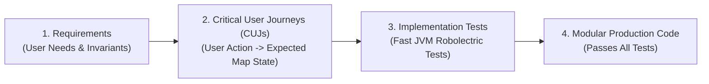
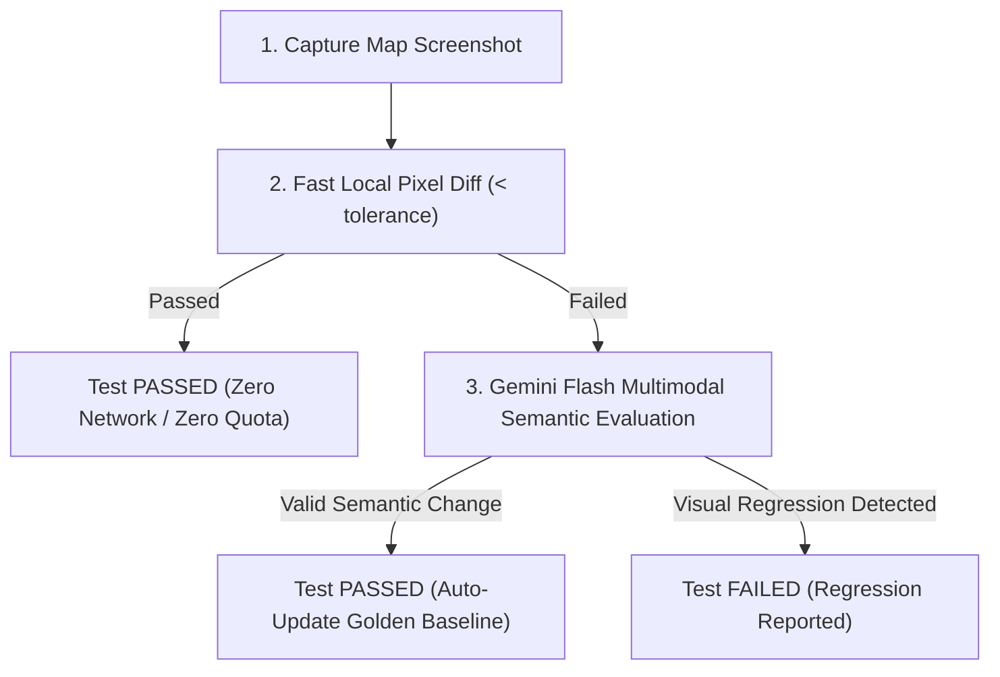

# Test-Driven Development (TDD) & Android Maps Robolectric Testing

This guide details the testing philosophy, Test-Driven Development (TDD) workflow, and integration recipes using the [**Android Maps Testing Toolkit (`android-maps-robolectric`)**](https://github.com/dkhawk/android-maps-robolectric) for fast, headless JVM testing of Google Maps SDK components without physical devices or emulator farms.

---

## 1. Core Software Development Tenets: Test All Code

1. **Every Feature Requires Tests**: No code should be shipped or accepted without accompanying unit and integration tests verifying its correctness.
2. **Adopt Test-Driven Development (TDD)**:
   - **Red**: Write a failing test first that specifies the expected behavior, constraints, and edge cases.
   - **Green**: Write the minimal, cleanest production code required to satisfy the test.
   - **Refactor**: Clean up the implementation, improve modularity, and eliminate duplication while keeping all tests passing.
3. **Solid Coverage on Every Function**: Ensure high branch and function coverage. Test boundary conditions (empty collections, invalid coordinates, network timeouts, null state, orientation changes).

---

## 2. Requirements &rarr; Critical User Journeys (CUJs) &rarr; Implementation Tests

When working with developers, execute this three-stage transformation:



### Stage 1: Solicit Requirements
Proactively clarify with the user:
- What are the core user goals (e.g. searching locations, tracking delivery vehicles, selecting delivery zones)?
- What map entities are displayed (markers, polylines, polygons, cluster overlays)?
- How does the map react to user input (tapping a marker, panning the viewport, dragging a pin)?
- What are the error states (offline mode, location permission denied, empty results)?

### Stage 2: Formalize Critical User Journeys (CUJs)
Translate requirements into concrete, falsifiable journeys:
- **CUJ-1 (Initial Viewport)**: When user launches screen, map initializes centered on the user's primary market (e.g., San Francisco @ zoom 12) with default zoom controls enabled.
- **CUJ-2 (Marker Population)**: When store locations load from repository, a marker is rendered for each location with correct title, snippet, and customized vector pin.
- **CUJ-3 (Selection & Camera Transition)**: When user selects a store item from the list, the camera smoothly animates to center on the store coordinate @ zoom 16, and the marker info window opens.
- **CUJ-4 (Clamping & Bounds)**: When user navigates, camera panning is clamped strictly within the authorized service area bounds.

### Stage 3: Build Implementation Tests First (TDD)
Before writing Activity or ViewModel code, implement test cases for each CUJ using `android-maps-robolectric`.

---

## 3. Setting Up `android-maps-robolectric`

The [`dkhawk/android-maps-robolectric`](https://github.com/dkhawk/android-maps-robolectric) library provides high-fidelity Robolectric shadows for the Google Maps SDK, bypassing Google Play Services dependencies and OpenGL hardware requirements.

In `build.gradle.kts`:
```kotlin
dependencies {
    // Android Maps Robolectric Shadows & Toolkit
    testImplementation("com.google.android.maps.robolectric:shadows:1.1.0-rc01")
    testImplementation("org.robolectric:robolectric:4.16.1")
    testImplementation("com.google.truth:truth:1.4.2")
    testImplementation("androidx.test:core:1.6.1")
    testImplementation("androidx.test.ext:junit:1.2.1")
}
```

Enable Robolectric Native Graphics or standard shadows in `robolectric.properties` or test annotations:
```properties
# test/resources/robolectric.properties
sdk=34
robolectric.graphicsMode=NATIVE
```

### Critical Robolectric Setup Invariants

1. **Explicit Shadow Registration with `@Config`**:
   In Robolectric 4.16+, if you apply `@Config(sdk = [...])` to a test class, Robolectric creates a new configuration that will **ignore shadows from meta-annotations** (such as `@EnableMapsShadows`). Always explicitly list the Google Maps shadows in `@Config(shadows = [...])` to guarantee they are registered:
   ```kotlin
   @RunWith(RobolectricTestRunner::class)
   @GraphicsMode(GraphicsMode.Mode.NATIVE)
   @Config(
       sdk = [34],
       shadows = [
           ShadowMapView::class,
           ShadowGoogleMap::class,
           ShadowCameraUpdate::class,
           ShadowCameraUpdateFactory::class,
           ShadowMarker::class,
           ShadowPolyline::class,
           ShadowPolygon::class,
           ShadowProjection::class,
           ShadowCircle::class,
           ShadowUiSettings::class,
           ShadowBitmapDescriptor::class,
           ShadowBitmapDescriptorFactory::class,
           ShadowMapsInitializer::class,
           ShadowSupportMapFragment::class,
           ShadowGroundOverlay::class,
           ShadowTileOverlay::class
       ]
   )
   class MyMapTest
   ```

2. **Main Looper Synchronization for `getMapAsync`**:
   Because `MapView.getMapAsync()` posts callback execution to `Looper.getMainLooper()`, tests must call `ShadowLooper.idleMainLooper()` immediately after calling `getMapAsync`:
   ```kotlin
   val mapRef = AtomicReference<GoogleMap>()
   mapView.getMapAsync { mapRef.set(it) }
   ShadowLooper.idleMainLooper() // Flush looper queue so onMapReady executes
   val googleMap = mapRef.get() // Guaranteed non-null
   val shadowMap = Shadow.extract(googleMap) as ShadowGoogleMap
   ```

---

## 4. TDD Recipes with `android-maps-robolectric`

### Recipe 1: Verifying Map Initialization & Camera Position
```kotlin
@RunWith(RobolectricTestRunner::class)
@GraphicsMode(GraphicsMode.Mode.NATIVE)
@Config(
    sdk = [34],
    shadows = [ShadowMapView::class, ShadowGoogleMap::class, ShadowCameraUpdate::class, ShadowCameraUpdateFactory::class]
)
class StoreMapViewModelTest {

    @Test
    fun `CUJ-1 initial map setup centers on default location with zoom`() = runTest {
        val activity = Robolectric.buildActivity(Activity::class.java).create().get()
        val mapView = MapView(activity).apply { onCreate(Bundle()) }

        val mapRef = AtomicReference<GoogleMap>()
        mapView.getMapAsync { mapRef.set(it) }
        ShadowLooper.idleMainLooper()

        val googleMap = mapRef.get()
        val camera = googleMap.cameraPosition
        assertThat(camera.target.latitude).isWithin(0.001).of(37.7749)
        assertThat(camera.target.longitude).isWithin(0.001).of(-122.4194)
        assertThat(camera.zoom).isEqualTo(12f)
    }
}
```

### Recipe 2: Testing Marker Rendering & Distance Matchers
```kotlin
@RunWith(RobolectricTestRunner::class)
class MarkerRenderingTest {

    @Test
    fun `CUJ-2 store repository items render as map markers with custom tags`() = runTest {
        val scenario = ActivityScenario.launch(MapActivity::class.java)
        scenario.onActivity { activity ->
            val map = activity.getGoogleMap() // Expose map or controller in test

            // Assert marker count
            val markers = ShadowGoogleMap.getMarkers(map)
            assertThat(markers).hasSize(3)

            val firstMarker = markers.first()
            assertThat(firstMarker.title).isEqualTo("Downtown Store")
            assertThat(firstMarker.snippet).isEqualTo("Open until 9 PM")
            
            // Geodesic distance assertion using Truth extension
            val expectedLocation = LatLng(37.7749, -122.4194)
            assertThat(firstMarker.position).isWithin(10.0).of(expectedLocation)
        }
    }
}
```

### Recipe 3: Testing Marker Click Events & Selection Flow
```kotlin
@RunWith(RobolectricTestRunner::class)
class MarkerInteractionTest {

    @Test
    fun `CUJ-3 clicking marker triggers selection and animates camera`() = runTest {
        val scenario = ActivityScenario.launch(MapActivity::class.java)
        scenario.onActivity { activity ->
            val map = activity.getGoogleMap()
            val marker = ShadowGoogleMap.getMarkers(map).first()

            // Simulate marker click
            val handled = ShadowGoogleMap.simulateMarkerClick(map, marker)
            assertThat(handled).isTrue()

            // Verify camera animation target
            val camera = map.cameraPosition
            assertThat(camera.target).isEqualTo(marker.position)
            assertThat(camera.zoom).isEqualTo(16f)

            // Verify info window opened
            assertThat(marker.isInfoWindowShown).isTrue()
        }
    }
}
```

### Recipe 4: Testing Polylines, Polygons, and Geometry
```kotlin
@RunWith(RobolectricTestRunner::class)
class MapGeometryTest {

    @Test
    fun `CUJ-4 delivery zone polygon renders with semi-transparent fill`() {
        val scenario = ActivityScenario.launch(DeliveryMapActivity::class.java)
        scenario.onActivity { activity ->
            val map = activity.getGoogleMap()
            val polygons = ShadowGoogleMap.getPolygons(map)

            assertThat(polygons).isNotEmpty()
            val deliveryZone = polygons.first()
            
            // Verify geometry
            assertThat(deliveryZone.points).hasSize(5) // Closed polygon
            assertThat(deliveryZone.strokeColor).isEqualTo(Color.BLUE)
            assertThat(Color.alpha(deliveryZone.fillColor)).isLessThan(255)
        }
    }
}
```

---

## 5. Deterministic Golden Image Testing (`:golden-testing`)

Screenshot and visual regression testing on live Google Maps is often flaky due to network tile latency, cartography data shifts, and API quotas.

The **`:golden-testing`** module solves this by setting `MAP_TYPE_NONE` and injecting deterministic, synthetic raster tiles (`GoldenTileProvider`).

### Setup
```kotlin
dependencies {
    testImplementation("com.google.android.maps.testing:golden:1.1.0-rc01")
}
```

### Tile Strategies
- `GoldenTileStrategy.CoordinateGrid`: Visual coordinate grid with tile boundaries and zoom/x/y coordinate labels.
- `GoldenTileStrategy.SolidColorHash`: Deterministic pastel solid color per `(x, y, zoom)` tile.
- `GoldenTileStrategy.Checkerboard`: High-contrast alternating checkerboard tiles.

### Golden Testing Recipe
```kotlin
@Test
fun `verify store map matches golden baseline`() = runTest {
    val scenario = ActivityScenario.launch(MapActivity::class.java)
    scenario.onActivity { activity ->
        val googleMap = activity.getGoogleMap()

        // 1. Enable golden testing with synthetic tile strategy
        val overlay = googleMap.enableGoldenTesting(
            strategy = GoldenTileStrategy.CoordinateGrid()
        )

        // 2. Wait for tiles and map rendering to stabilize
        googleMap.awaitMapLoaded()

        // 3. Capture snapshot bitmap
        val currentBitmap = googleMap.captureSnapshot()

        // 4. Assert pixel diff against reference golden
        val goldenBitmap = loadGoldenBitmap("store_map_baseline.png")
        val diffResult = GoldenImageDiff.compare(
            actual = currentBitmap,
            expected = goldenBitmap,
            tolerancePercentage = 0.01f // 1% allowable pixel variance
        )

        // Highlight regressions with red diff overlay if test fails
        if (!diffResult.passed) {
            saveDiffArtifact("store_map_diff.png", diffResult.diffBitmap)
            fail("Golden comparison failed: ${diffResult.differencePercentage}% pixel divergence")
        }
    }
}
```

### Compose Support
In Jetpack Compose, use `rememberGoldenTileProvider()`:
```kotlin
val goldenTileProvider = rememberGoldenTileProvider(GoldenTileStrategy.CoordinateGrid())
GoogleMap(
    properties = MapProperties(mapType = MapType.NONE)
) {
    TileOverlay(tileProvider = goldenTileProvider)
    Marker(state = rememberMarkerState(position = targetLocation))
}
```

---

## 6. AI Visual Testing & Hybrid Fallback (`:visual-testing`)

For scenarios where rigid pixel comparisons are too brittle (e.g. minor GPU antialiasing variances, dynamic text rendering, or natural language UI criteria), the **`:visual-testing`** module combines **Google Gemini Multimodal AI** with **UiAutomator**.

### Setup
```kotlin
dependencies {
    androidTestImplementation("com.google.android.maps.testing:visual:1.1.0-rc01")
}
```

Provide the API key via environment variable:
```bash
export GEMINI_API_KEY="AIzaSy...YOUR_KEY"
```

### Hybrid Golden Fallback Workflow (`verifyScreenshotWithGoldenFallback`)
Combines the speed of local pixel diffing with the resilience of semantic AI evaluation:



```kotlin
@Test
fun `verify map view semantics with hybrid AI fallback`() = runTest {
    val orchestrator = VisualTestOrchestrator(context)

    // Executes local pixel diff first; falls back to Gemini if pixel diff diverges
    val result = orchestrator.verifyScreenshotWithGoldenFallback(
        goldenName = "paris_landmarks",
        semanticPrompt = """
            Verify that:
            1. An actual map is visually rendered with visible streets, water, or terrain features.
            2. The map viewport is NOT an empty, solid-color (beige/grey) canvas with only a Google watermark.
            3. The Eiffel Tower marker is clearly visible as an icon on the map.
            4. The custom info window displays without overlapping bottom navigation.
        """.trimIndent(),
        tolerancePercentage = 0.02f
    )

    assertThat(result.passed).isTrue()
}
```

---

## 7. Visual Verification Rigor: Detecting Blank Map & Tile Regressions

> [!CAUTION]
> **The "Empty Watermark" Failure Mode**:  
> When the Google Maps SDK encounters an API key authorization failure (such as an unauthorized package name / Application ID, mismatched SHA-1 fingerprint, or quota exhaustion), the SDK **does not crash**. Instead, it renders an **empty, solid beige or grey canvas with only the Google logo watermark** in the bottom-left corner.  
> Tests that only inspect the Android View hierarchy (`uiautomator dump`, `findViewById`, or checking ViewModel state) will **falsely report success** because UI controls and container views are present, completely missing the fact that **no map is visible to the user**.

### Mandatory Visual Verification Rules for Maps

To prevent false-positive visual verification:

#### 1. Explicit Non-Blank Canvas Invariant
Visual testing must verify that the map surface contains actual visual data:
- **For live maps**: The viewport must contain visible roads, geographical labels, water bodies, or terrain features. A screen where >90% of the map viewport is a single uniform background color (e.g. `#EAE6DC` / `#E0E0E0`) with only a watermark **MUST be rejected as a failed test**.
- **For offline golden tests (`:golden-testing`)**: Synthetic tile strategies (`CoordinateGrid`, `Checkerboard`, `SolidColorHash`) inject high-frequency pixel variations. If the map fails to initialize or tiles do not load, `GoldenImageDiff` will immediately produce a catastrophic pixel divergence (>80%), failing the test deterministically.

#### 2. Visual Entity Presence Invariant
Never assume markers or polylines are visible just because they were added to an in-memory list:
- **Polylines**: Must produce visible colored pixel tracks across the map surface.
- **Markers**: Must render visible glyphs/pins at their projected pixel coordinates.
- **Info Cards / Popups**: Must appear above the map and contain populated text.

#### 3. Strict AI Evaluation Prompt Template
When evaluating screenshots with Multimodal AI (Gemini Vision), always include strict negative criteria:

```text
EVALUATION PROMPT TEMPLATE:

You are verifying a Google Maps Android application screen.
Evaluate the attached screenshot against these strict criteria:

1. MAP SURFACE VERIFICATION:
   - Is an actual, populated map rendered across the background showing streets, terrain, or water features?
   - REJECT IMMEDIATELY if the map area is a blank, solid beige or grey canvas showing only the Google logo.

2. OVERLAY & ENTITY VERIFICATION:
   - Are the expected markers (fountain pins, store locations) visually rendered on the map surface?
   - Is the expected route or path polyline visible with its specified color?

3. UI & COMPOSITE ELEMENTS:
   - Are header cards, filter chips, and action buttons properly displayed without obscuring the primary map subject?

OUTPUT REQUIREMENT:
If any criterion fails—especially if the map surface is blank—fail the test and report the exact visual defect.
```

---

## 8. Summary of Testing Capabilities Matrix

| Capability | `:robolectric-testing` | `:golden-testing` | `:visual-testing` |
| :--- | :---: | :---: | :---: |
| **Primary Goal** | Fast Behavioral / Functional Unit Tests | Deterministic Pixel Regression | Semantic UI / Resilient Visual QA |
| **Execution Environment** | Headless Local JVM | Local JVM (RNG) & Android Device | Android Device / Emulator |
| **Network & Quota Required** | ❌ None | ❌ None (Synthetic Tiles) | ⚠️ Only for Gemini AI API calls |
| **Catches Blank Map Failures** | ⚠️ In-memory only | ✅ Strict Pixel Diff (>80% failure) | ✅ Multimodal Semantic Rejection |
| **Camera & Viewport Testing** | ✅ Full Simulation | ✅ Synthetic Raster | ✅ Full Visual Inspection |
| **Marker & Shape Interactions** | ✅ Clicks, Drags, Info Windows | ⚠️ Indirect | ✅ UiAutomator AI Actions |
| **Truth Distance Matchers** | ✅ `isWithin(20.meters)` | ❌ N/A | ❌ N/A |
| **Strict Pixel Diff Engine** | ❌ N/A | ✅ `GoldenImageDiff` | ✅ Hybrid Pixel Diff |
| **Natural Language Verification** | ❌ N/A | ❌ N/A | ✅ Gemini Flash Multimodal |
| **Jetpack Compose Integration** | ✅ Supported | ✅ `rememberGoldenTileProvider` | ✅ Supported |

