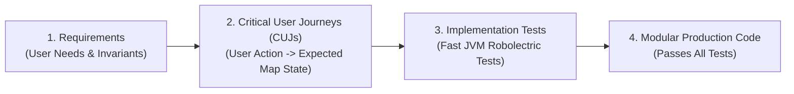

# Test-Driven Development (TDD) & Android Maps Robolectric Testing

This guide details the testing philosophy, Test-Driven Development (TDD) workflow, and integration recipes using the [**Android Maps Testing Toolkit (`android-maps-robolectric`)**](https://github.com/dkhawk/android-maps-robolectric) for fast, headless JVM testing of Google Maps SDK components without physical devices or emulator farms.

---

## 1. Core Software Development Tenets: Test All Code

1. **Every Feature Requires Tests**: No code should be shipped or accepted without accompanying unit and integration tests verifying its correctness.
2. **Adopt Test-Driven Development (TDD)**:
   - **Red**: Write a failing test first that specifies the expected behavior, constraints, and edge cases.
   - **Green**: Write the minimal, cleanest production code required to satisfy the test.
   - **Refactor**: Clean up the implementation, improve modularity, and eliminate duplication while keeping all tests passing.
3. **Solid Coverage on Every Function**: Ensure high branch and function coverage. Test boundary conditions (empty collections, invalid coordinates, network timeouts, null state, orientation changes).

---

## 2. Requirements &rarr; Critical User Journeys (CUJs) &rarr; Implementation Tests

When working with developers, execute this three-stage transformation:



### Stage 1: Solicit Requirements
Proactively clarify with the user:
- What are the core user goals (e.g. searching locations, tracking delivery vehicles, selecting delivery zones)?
- What map entities are displayed (markers, polylines, polygons, cluster overlays)?
- How does the map react to user input (tapping a marker, panning the viewport, dragging a pin)?
- What are the error states (offline mode, location permission denied, empty results)?

### Stage 2: Formalize Critical User Journeys (CUJs)
Translate requirements into concrete, falsifiable journeys:
- **CUJ-1 (Initial Viewport)**: When user launches screen, map initializes centered on the user's primary market (e.g., San Francisco @ zoom 12) with default zoom controls enabled.
- **CUJ-2 (Marker Population)**: When store locations load from repository, a marker is rendered for each location with correct title, snippet, and customized vector pin.
- **CUJ-3 (Selection & Camera Transition)**: When user selects a store item from the list, the camera smoothly animates to center on the store coordinate @ zoom 16, and the marker info window opens.
- **CUJ-4 (Clamping & Bounds)**: When user navigates, camera panning is clamped strictly within the authorized service area bounds.

### Stage 3: Build Implementation Tests First (TDD)
Before writing Activity or ViewModel code, implement test cases for each CUJ using `android-maps-robolectric`.

---

## 3. Setting Up `android-maps-robolectric`

The [`dkhawk/android-maps-robolectric`](https://github.com/dkhawk/android-maps-robolectric) library provides high-fidelity Robolectric shadows for the Google Maps SDK, bypassing Google Play Services dependencies and OpenGL hardware requirements.

In `build.gradle.kts`:
```kotlin
dependencies {
    // Android Maps Robolectric Shadows & Toolkit
    testImplementation("com.google.android.maps.robolectric:shadows:1.1.0-rc01")
    testImplementation("org.robolectric:robolectric:4.16.1")
    testImplementation("com.google.truth:truth:1.4.2")
    testImplementation("androidx.test:core:1.6.1")
    testImplementation("androidx.test.ext:junit:1.2.1")
}
```

Enable Robolectric Native Graphics or standard shadows in `robolectric.properties` or test annotations:
```properties
# test/resources/robolectric.properties
robolectric.graphicsMode=NATIVE
```

---

## 4. TDD Recipes with `android-maps-robolectric`

### Recipe 1: Verifying Map Initialization & Camera Position
```kotlin
@RunWith(RobolectricTestRunner::class)
class StoreMapViewModelTest {

    @Test
    fun `CUJ-1 initial map setup centers on default location with zoom`() = runTest {
        // 1. Arrange: Create Activity / Fragment via Robolectric
        val controller = Robolectric.buildActivity(MapActivity::class.java).setup()
        val activity = controller.get()
        val mapFragment = activity.supportFragmentManager
            .findFragmentById(R.id.map_container) as SupportMapFragment

        // 2. Act: Await map ready via shadow
        val googleMap = mapFragment.awaitMap()

        // 3. Assert: Verify camera position using Truth
        val camera = googleMap.cameraPosition
        assertThat(camera.target.latitude).isWithin(0.001).of(37.7749)
        assertThat(camera.target.longitude).isWithin(0.001).of(-122.4194)
        assertThat(camera.zoom).isEqualTo(12f)
    }
}
```

### Recipe 2: Testing Marker Rendering & Distance Matchers
```kotlin
@RunWith(RobolectricTestRunner::class)
class MarkerRenderingTest {

    @Test
    fun `CUJ-2 store repository items render as map markers with custom tags`() = runTest {
        val scenario = ActivityScenario.launch(MapActivity::class.java)
        scenario.onActivity { activity ->
            val map = activity.getGoogleMap() // Expose map or controller in test

            // Assert marker count
            val markers = ShadowGoogleMap.getMarkers(map)
            assertThat(markers).hasSize(3)

            val firstMarker = markers.first()
            assertThat(firstMarker.title).isEqualTo("Downtown Store")
            assertThat(firstMarker.snippet).isEqualTo("Open until 9 PM")
            
            // Geodesic distance assertion using Truth extension
            val expectedLocation = LatLng(37.7749, -122.4194)
            assertThat(firstMarker.position).isWithin(10.0).of(expectedLocation)
        }
    }
}
```

### Recipe 3: Testing Marker Click Events & Selection Flow
```kotlin
@RunWith(RobolectricTestRunner::class)
class MarkerInteractionTest {

    @Test
    fun `CUJ-3 clicking marker triggers selection and animates camera`() = runTest {
        val scenario = ActivityScenario.launch(MapActivity::class.java)
        scenario.onActivity { activity ->
            val map = activity.getGoogleMap()
            val marker = ShadowGoogleMap.getMarkers(map).first()

            // Simulate marker click
            val handled = ShadowGoogleMap.simulateMarkerClick(map, marker)
            assertThat(handled).isTrue()

            // Verify camera animation target
            val camera = map.cameraPosition
            assertThat(camera.target).isEqualTo(marker.position)
            assertThat(camera.zoom).isEqualTo(16f)

            // Verify info window opened
            assertThat(marker.isInfoWindowShown).isTrue()
        }
    }
}
```

### Recipe 4: Testing Polylines, Polygons, and Geometry
```kotlin
@RunWith(RobolectricTestRunner::class)
class MapGeometryTest {

    @Test
    fun `CUJ-4 delivery zone polygon renders with semi-transparent fill`() {
        val scenario = ActivityScenario.launch(DeliveryMapActivity::class.java)
        scenario.onActivity { activity ->
            val map = activity.getGoogleMap()
            val polygons = ShadowGoogleMap.getPolygons(map)

            assertThat(polygons).isNotEmpty()
            val deliveryZone = polygons.first()
            
            // Verify geometry
            assertThat(deliveryZone.points).hasSize(5) // Closed polygon
            assertThat(deliveryZone.strokeColor).isEqualTo(Color.BLUE)
            assertThat(Color.alpha(deliveryZone.fillColor)).isLessThan(255)
        }
    }
}
```

---

## 5. Summary of TDD Invariants for Maps

| Invariant | Why It Matters | Verification Tool |
| :--- | :--- | :--- |
| **No API Key Dependency in Unit Tests** | Tests run safely on test farms, PR bots, and CI without quota limits or secret leakage. | `android-maps-robolectric` |
| **Fast JVM Feedback Loop** | Unit tests complete in < 2 seconds rather than minutes for emulator deploys. | Robolectric Runner |
| **Complete Function Coverage** | Every use case, data transformation, and map controller method has a dedicated test. | JaCoCo / Gradle `testDebugUnitTest` |
| **Falsifiable CUJ Validation** | Features directly trace back to verifiable user expectations. | Requirements &rarr; CUJ &rarr; Test matrix |
