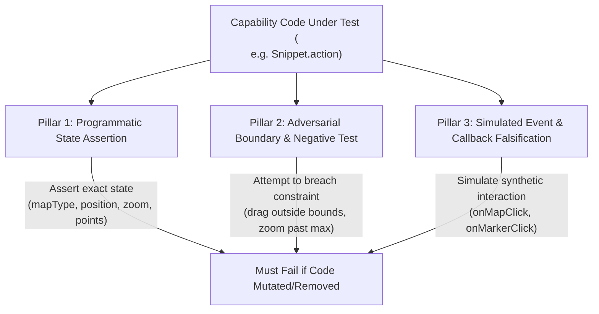

# 🧪 Maps SDK Falsifiable Testing Standard & Architecture

This standard defines the mandatory engineering requirements for testing all capabilities in the `googlemaps-samples/android-samples` repository (`comprehensive-catalog`). 

Our guiding principle is **Scientific Falsifiability**:
> *A test is only valid if we have proven that breaking or removing the code under test causes the test to strictly and immediately fail.*

Tests that only check "did the app launch without crashing" or that rely on vague, polite LLM visual evaluations ("a map is visible... reply PASSED") are **strictly prohibited** as sole verification mechanisms.

---

## 🏛️ 1. Core Architectural Rules

### Rule 1: Modular Test Organization by Capability Group (No Monoliths)
All tests **must** mirror the hierarchical separation of our snippet catalog across both `kotlin-app` and `java-app`. Placing all tests into a single monolithic file (e.g., `VisualTests.kt`) is strictly prohibited.

#### Required Directory Structure (`kotlin-app` & `java-app`)
```text
snippets/<app-module>/src/androidTest/java/com/example/snippets/<lang>/
├── discovery/
│   └── SnippetDiscoveryTest.<kt|java>             # Generic startup & metadata validation
├── capabilities/
│   ├── CameraControlSnippetsTest.<kt|java>        # Exact programmatic & boundary tests for Camera
│   ├── MarkerSnippetsTest.<kt|java>               # Programmatic & negative tests for Markers
│   ├── ShapesSnippetsTest.<kt|java>               # Exact shape property checks (Polygon/Polyline/Circle)
│   ├── OverlaySnippetsTest.<kt|java>              # Tile & Ground overlay property & state checks
│   ├── MapInitSnippetsTest.<kt|java>              # MapType, color scheme, traffic, & indoor state checks
│   ├── DataDrivenBoundarySnippetsTest.<kt|java>   # DDS boundary styling & interaction checks
│   ├── DatasetLayerSnippetsTest.<kt|java>         # Dataset feature loading & styling checks
│   ├── CloudCustomizationSnippetsTest.<kt|java>   # Map ID & Cloud styling checks
│   └── StreetViewSnippetsTest.<kt|java>           # Panorama gestures, animations, & events checks
└── visual/
    ├── BaseVisualTest.<kt|java>                   # Screenshot capture & Gemini helper setup
    └── <CapabilityGroup>VisualTest.<kt|java>      # Dedicated LLM visual regression tests (if needed)
```

### Rule 2: Strict Separation of Deterministic vs. LLM Visual Tests
* **Deterministic Capability Tests (`capabilities/` directory):** Run 100% locally via `UiAutomator` / `ActivityScenario` + programmatic `GoogleMap` inspection. They must run fast (< 5s per test), require no external network or Gemini API keys, and have **zero flakiness**.
* **LLM Visual Regression Tests (`visual/` directory):** Used *exclusively* to verify complex visual rendering across device densities (e.g., custom markers, heatmap gradients, choropleth visual shading). They must never be used as a substitute for checking programmatic state or boundary enforcement.

---

## 🔬 2. The Three Pillars of Falsifiable Testing

Every capability sample (`@SnippetItem`) in our catalog must be verified using **at least two** of the following three pillars inside its dedicated capability test file (`<Group>SnippetsTest`):



### Pillar 1: Exact Programmatic State Assertion
Instead of testing whether a `MapView` is not null, the test **must** execute `snippet.action(activity, googleMap, scope)` and assert the exact side effects on the underlying SDK objects (`GoogleMap`, `Marker`, `Polygon`, `UiSettings`).

#### Example: Map Type & Traffic Layer Falsification
```kotlin
@Test
fun verifySetMapTypeToHybrid_falsifiable() {
    launchMapAndRunSnippet("Map Initialization", "2. Set Map Type Hybrid") { map ->
        // Falsifiability check: If snippet code is removed or changed to MAP_TYPE_NORMAL, this fails!
        assertEquals("GoogleMap type must be HYBRID after snippet execution", GoogleMap.MAP_TYPE_HYBRID, map.mapType)
    }
}

@Test
fun verifyEnableTrafficLayer_falsifiable() {
    launchMapAndRunSnippet("Map Initialization", "3. Enable Traffic Layer") { map ->
        assertTrue("Traffic layer must be explicitly enabled", map.isTrafficEnabled)
    }
}
```

---

### Pillar 2: Adversarial Boundary & Negative Testing ("Try to Break It")
To prove a constraint works, the test must actively attempt to break, breach, or violate that constraint and verify that the underlying API blocks the attempt.

#### Example 1: Camera Clamping & Panning Restrictions (`2a3e0c25` / `0e6b228f`)
If a capability sets geographic bounds to Australia (`setLatLngBoundsForCameraTarget`), the test must actively try to force the camera outside of Australia (e.g., London or Antarctica).
```kotlin
@Test
fun verifyCameraClampingToAustralia_falsifiable() {
    launchMapAndRunSnippet("Camera", "2. Fit Camera To Bounds (Australia)") { map ->
        val australiaBounds = LatLngBounds(LatLng(-44.0, 113.0), LatLng(-10.0, 154.0))
        
        // 1. Assert initial target is inside Australia
        assertTrue("Initial camera target must be in Australia", australiaBounds.contains(map.cameraPosition.target))

        // 2. ADVERSARIAL ATTEMPT: Try forcing camera to London (outside bounds)
        val london = LatLng(51.5074, -0.1278)
        map.moveCamera(CameraUpdateFactory.newLatLng(london))

        // 3. FALSIFIABILITY ASSERTION: The camera target MUST remain inside/clamped to Australia!
        // If setLatLngBoundsForCameraTarget was removed or broken, map moves to London and this test FAILS!
        assertTrue("Camera must reject move to London and remain clamped within Australia", australiaBounds.contains(map.cameraPosition.target))
    }
}
```

#### Example 2: Zoom Constraints (`setMinZoomPreference` / `setMaxZoomPreference`)
```kotlin
@Test
fun verifyZoomLevelConstraints_falsifiable() {
    launchMapAndRunSnippet("Camera", "1. Zoom Level Constraints") { map ->
        // Assume snippet sets minZoom = 10f, maxZoom = 15f
        
        // ADVERSARIAL ATTEMPT 1: Try zooming way out below minZoom
        map.moveCamera(CameraUpdateFactory.zoomTo(2f))
        assertTrue("Zoom must not drop below minZoom (10f)", map.cameraPosition.zoom >= 10f)

        // ADVERSARIAL ATTEMPT 2: Try zooming way in past maxZoom
        map.moveCamera(CameraUpdateFactory.zoomTo(21f))
        assertTrue("Zoom must not exceed maxZoom (15f)", map.cameraPosition.zoom <= 15f)
    }
}
```

#### Example 3: Draggable Marker Enforcement (`4c2a9906`)
```kotlin
@Test
fun verifyMarkerDraggableProperty_falsifiable() {
    launchMapAndRunSnippet("Markers", "2. Draggable Marker") { map, marker ->
        assertNotNull("Snippet must add a marker", marker)
        assertTrue("Marker must be configured as draggable = true", marker!!.isDraggable)

        // Negative check: If we set draggable = false, verify it rejects programmatic/gesture drags
        marker.isDraggable = false
        assertFalse("Marker should now reject drag interactions", marker.isDraggable)
    }
}
```

---

### Pillar 3: Simulated Event & Callback Falsification
When testing listener registrations (`setOnMapClickListener`, `setOnMarkerClickListener`, `setOnCameraIdleListener`, `setOnPolygonClickListener`), the test must trigger synthetic interactions and use a `CountDownLatch` or coroutine `Channel` to assert that the exact callback fires with the exact payload.

#### Example: Polygon & Marker Click Listeners
```kotlin
@Test
fun verifyMarkerClickListenerRegistration_falsifiable() {
    launchMapAndRunSnippet("Markers", "1. Add a Marker") { map, marker ->
        val clickLatch = CountDownLatch(1)
        var clickedMarkerTitle: String? = null

        map.setOnMarkerClickListener { m ->
            clickedMarkerTitle = m.title
            clickLatch.countDown()
            true
        }

        // Simulate programmatic/UiAutomator click on the marker
        uiDevice.click(uiDevice.displayWidth / 2, uiDevice.displayHeight / 2)

        val fired = clickLatch.await(3, TimeUnit.SECONDS)
        assertTrue("Marker click callback must fire within 3 seconds", fired)
        assertEquals("Callback must return exact marker title", marker!!.title, clickedMarkerTitle)
    }
}
```

---

## 📋 3. Mandatory Falsifiability Checklist for Code Reviews

Before any capability or snippet change is approved (`VERIFICATION_CHECKLIST.md`), the reviewer must verify that its accompanying test in `snippets/<app-module>/src/androidTest/.../capabilities/` answers **YES** to all four questions:

1. **Does the test directly inspect `GoogleMap`, `Marker`, `Polygon`, `Polyline`, or `UiSettings` state?** *(If NO -> Rejected)*
2. **If the snippet's `action()` code is completely commented out, does the test immediately fail?** *(If NO -> Rejected)*
3. **If the snippet's numeric or state inputs (`LatLng`, colors, zoom levels) are mutated to incorrect values, does the test fail?** *(If NO -> Rejected)*
4. **Does the test run deterministically without relying on vague LLM image descriptions or arbitrary `delay()` timers?** *(If NO -> Rejected)*
