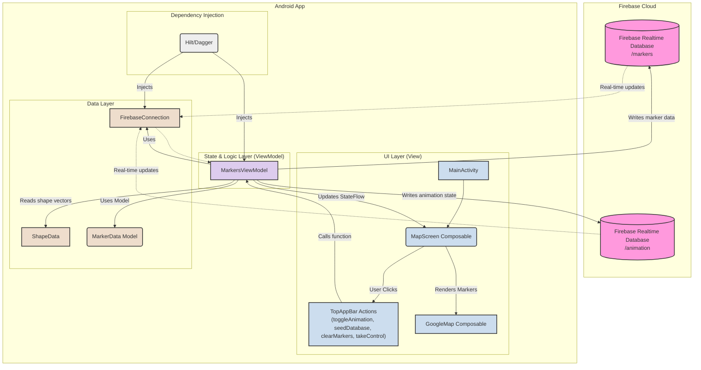

# FireMarkers Architecture

This document provides a visual overview of the FireMarkers application's architecture. The core of the app is a **controller/agent synchronization pattern** that uses Firebase Realtime Database to keep multiple devices in sync.

## Architecture Diagram



### How it Works

The application uses a controller/agent model to synchronize animations across devices.

1.  **Controller and Agents:** At any time, only one device is the **controller**. It is responsible for running the animation loop and writing the current animation state (progress, running status) to the `/animation` node in Firebase. All other devices are **agents** that passively listen for changes to this node.
2.  **UI Layer:** The `MainActivity` hosts the `MapScreen` composable. The UI in the `TopAppBar` is dynamic:
    *   If the device is the **controller**, it shows buttons to `toggleAnimation`, `seedDatabase`, and `clearMarkers`.
    *   If the device is an **agent**, it shows a single button that allows the user to `takeControl`.
3.  **ViewModel:** UI interactions call functions on the `MarkersViewModel`.
    *   If the controller toggles the animation, the ViewModel starts a local animation loop and writes the progress to the `/animation` node in Firebase.
    *   If an agent requests control, the ViewModel updates the `controllerId` field in the `/animation` node.
4.  **Data Layer:**
    *   The `MarkersViewModel` uses the `FirebaseConnection` service to interact with Firebase.
    *   The `ShapeData` object provides the static vector coordinates for the jack-o'-lantern and tree shapes.
5.  **Real-time Updates:** The `MarkersViewModel` establishes listeners on two Firebase paths:
    *   `/markers`: When the marker data changes (e.g., after seeding), Firebase pushes the updates to all clients.
    *   `/animation`: When the animation state changes (written by the controller), Firebase pushes the new state to all agents.
6.  **State Flow & Interpolation:** The `MarkersViewModel` uses a `combine` operator on two `StateFlow`s (one for markers, one for animation state). When new data is received from either listener, it recalculates the interpolated position and color for every marker based on the animation progress (`fraction`).
7.  **UI Update:** The `MapScreen` composable collects the final `StateFlow` of interpolated marker data. On each new emission, the `GoogleMap` recomposes and smoothly animates the markers to their new positions and colors.
8.  **Dependency Injection:** Hilt provides the `FirebaseConnection` as a singleton to the `MarkersViewModel`.

```