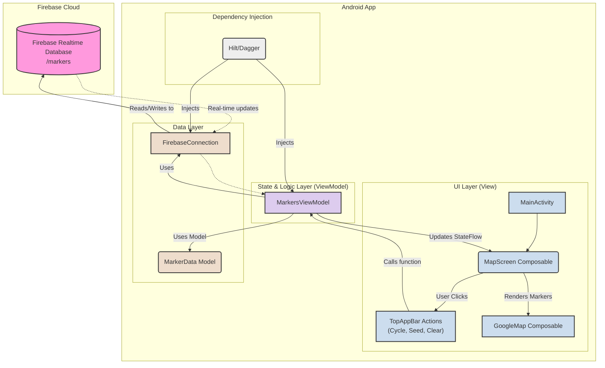

# FireMarkers Architecture

This document provides a visual overview of the FireMarkers application's architecture using a Mermaid diagram. This helps to understand the flow of data and user interactions within the app.

## Architecture Diagram



### How it Works

1.  **UI Layer:** The `MainActivity` hosts the `MapScreen` composable. The user interacts with the `TopAppBar` buttons (`IconButton`s).
2.  **ViewModel:** These UI interactions call functions on the `MarkersViewModel` (e.g., `seedDatabase()`, `clearMarkers()`).
3.  **Data Layer:** The `MarkersViewModel` uses the `FirebaseConnection` service to send commands to the Firebase Realtime Database (e.g., write new markers, remove all markers).
4.  **Real-time Updates:** The `MarkersViewModel` also establishes a listener to the database. When data changes in the `/markers` path, Firebase pushes the update to the app.
5.  **State Flow:** The `MarkersViewModel` receives the updated data and emits it to a `StateFlow`.
6.  **UI Update:** The `MapScreen` composable collects the `StateFlow`. When a new list of markers is emitted, the `GoogleMap` recomposes and re-renders the markers on the screen.
7.  **Dependency Injection:** Hilt is used to provide the `FirebaseConnection` as a singleton to the `MarkersViewModel`, decoupling the layers.

```