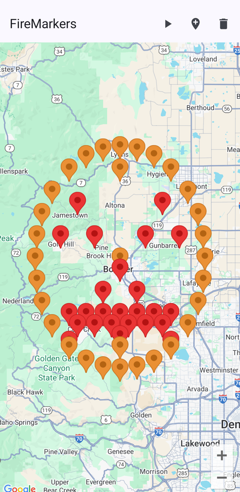

# Realtime, Synchronized Map Animations with Firebase and Google Maps

This sample demonstrates how to use the Firebase Realtime Database to drive perfectly synchronized, live animations on a Google Map across multiple Android devices. It showcases a **controller/agent architecture** where one device drives the animation state, and all other connected devices act as passive observers, ensuring all users see the same animation at the same time.

The app displays a set of markers that can animate between two complex shapes: a jack-o'-lantern and a Christmas tree. One device acts as the "controller," with UI controls to start, stop, and reset the animation. All other devices are "agents," with a button to take control.

| Controller View                                                                                   | Agent View                                                                         |
|:--------------------------------------------------------------------------------------------------|:---------------------------------------------------------------------------------------|
|  |  |

## Key Concepts Demonstrated

*   **Firebase Realtime Database:** Connecting an Android app to a Firebase Realtime Database.
*   **Controller/Agent Synchronization:** A robust pattern where one device ("controller") writes animation state to Firebase, and other devices ("agents") listen for real-time updates to synchronize their UIs.
*   **Shared Real-time State:** Using a separate `/animation` node in Firebase to store and sync shared state like animation progress, running status, and the current controller's ID.
*   **Dynamic, State-Driven UI:** Using Jetpack Compose to build a UI that dynamically changes its controls based on whether the device is the current controller or an agent.
*   **Procedural Animation:** Implementing a client-side animation loop that smoothly interpolates marker properties (latitude, longitude, and color) between two predefined vector shapes.
*   **Hilt for Dependency Injection:** Using Hilt to provide a singleton `FirebaseDatabase` instance to the application's ViewModel.

For a detailed visual guide to the project's structure and data flow, see the [**ARCHITECTURE.md**](ARCHITECTURE.md) file.

## Getting Started

This sample uses the Gradle build system. To build the app, use the `gradlew build` command or use "Import Project" in Android Studio.

### Prerequisites

*   Android Studio (latest version recommended)
*   An Android device or emulator with API level 24 or higher
*   A Google account to create a Firebase project

### Setup

To run this sample, you will need a Firebase project and a Google Maps API key.

**1. Set up your Firebase Project:**

The easiest way to connect your app to Firebase is by using the **Firebase Assistant** in Android Studio.

*   In Android Studio, go to **Tools > Firebase**.
*   In the Assistant panel, expand **Realtime Database** and follow the on-screen instructions to:
    1.  **Connect to Firebase:** This will open a browser for you to log in and either create a new Firebase project or select an existing one.
    2.  **Add Realtime Database to your app:** This will automatically add the necessary dependencies to your `build.gradle.kts` file and download the `google-services.json` configuration file into the `app/` directory.

*   For more detailed instructions, see the official guide: [**Add Firebase to your Android project**](https://firebase.google.com/docs/android/setup).

**2. Configure Database Rules:**

For this sample to work, your Realtime Database must be configured with public read/write rules. In the Firebase console, navigate to your **Realtime Database** and select the **Rules** tab. Replace the existing rules with the following:

```json
{
  "rules": {
    ".read": "true",
    ".write": "true"
  }
}
```
**Note:** These rules are for demonstration purposes only and are **insecure**. They allow anyone to read or write to your database. For a production app, you must implement more restrictive rules to protect your data. See the official guide on [**Securing Realtime Database Rules**](https://firebase.google.com/docs/database/security) for more information.

**3. Add your Google Maps API Key:**

The app requires a Google Maps API key to display the map.

1.  Follow the [**Maps SDK for Android documentation**](https://developers.google.com/maps/documentation/android-sdk/get-api-key) to get an API key.
2.  Create a file named `secrets.properties` in the project's root directory (at the same level as `local.properties`).
3.  Add your API key to the `secrets.properties` file, like this:
    ```
    MAPS_API_KEY="YOUR_API_KEY"
    ```
    (Replace `YOUR_API_KEY` with the key you obtained). The project is configured to read this key via the Secrets Gradle Plugin.

> **⚠️ IMPORTANT SECURITY NOTE:** You must prevent your API key from being checked into source control. The included `.gitignore` file is configured to ignore the `secrets.properties` file. **Do not remove this entry.** Committing your API key to a public repository can lead to unauthorized use and result in unexpected charges to your account.

Once you have completed these steps, you can run the app on your device or emulator.
