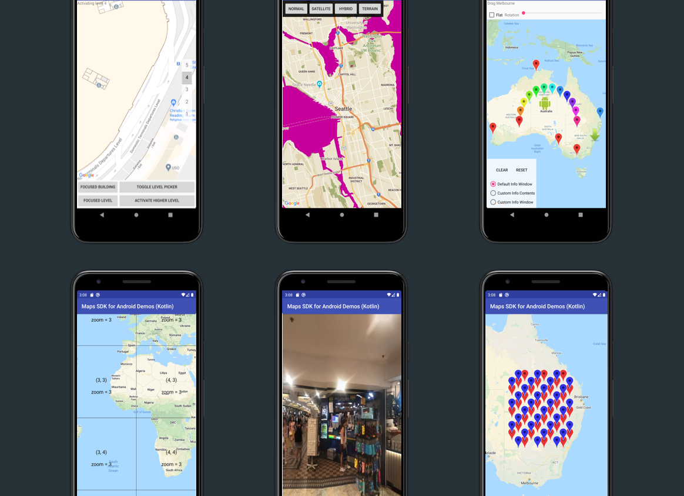

[][license]

[][Discord server]

# Google Maps SDK for Android Samples

## Description

Samples demonstrating how to use
[Maps SDK for Android](https://developers.google.com/maps/documentation/android-sdk).

## Samples in this repo (if more than one)

This repo contains the following samples:

1. [ApiDemos](ApiDemos): A collection of small demos showing most features of the Maps SDK for Android.
1. [WearOS](WearOS):
Displays a map on a Wear OS device. This sample demonstrates the basic
setup required for a gradle-based Android Studio project.
1. [Tutorials](https://github.com/googlemaps/android-samples/tree/main/tutorials): Samples
associated with tutorials in the developer's guide. See each sample for a link to the associated guide.
1. [Snippets](snippets): Snippets for code found in https://developers.google.com/maps/documentation/android-sdk

## Requirements

To run the samples, you will need:

- To [sign up with Google Maps Platform]
- A Google Maps Platform [project] with the **Maps SDK for Android** enabled
- An [API key] associated with the project above ... follow the [API key instructions] if you're new to the process
- See each sample for pre-requisites.
- All require up-to-date versions of the Android build tools and the Android support repository.

## Running the sample(s)

1. Download the samples by cloning this repository
1. In the welcome screen of Android Studio, select "Open an Existing project"
1. Select one of the sample directories from this repository

Alternatively, use the `gradlew build` command to build the project directly or download an APK
under [releases](https://github.com/googlemaps/android-samples/releases).

## Contributing

Contributions are welcome and encouraged! If you'd like to contribute, send us a [pull request] and refer to our [code of conduct] and [contributing guide].

## Terms of Service

This sample uses Google Maps Platform services. Use of Google Maps Platform services through this sample is subject to the Google Maps Platform [Terms of Service].

If your billing address is in the European Economic Area, effective on 8 July 2025, the [Google Maps Platform EEA Terms of Service](https://cloud.google.com/terms/maps-platform/eea) will apply to your use of the Services. Functionality varies by region. [Learn more](https://developers.google.com/maps/comms/eea/faq).

This sample is not a Google Maps Platform Core Service. Therefore, the Google Maps Platform Terms of Service (e.g. Technical Support Services, Service Level Agreements, and Deprecation Policy) do not apply to the code in this sample.

## Support

This sample is offered via an open source [license]. It is not governed by the Google Maps Platform Support [Technical Support Services Guidelines], the [SLA], or the [Deprecation Policy]. However, any Google Maps Platform services used by the sample remain subject to the Google Maps Platform Terms of Service.

If you find a bug, or have a feature request, please [file an issue] on GitHub. If you would like to get answers to technical questions from other Google Maps Platform developers, ask through one of our [developer community channels]. If you'd like to contribute, please check the [contributing guide].

You can also discuss this sample on our [Discord server].

[android-sdk]: https://developers.google.com/maps/documentation/android-sdk
[API key]: https://developers.google.com/maps/documentation/android-sdk/get-api-key
[API key instructions]: https://developers.google.com/maps/documentation/android-sdk/config#step_3_add_your_api_key_to_the_project

[code of conduct]: ?tab=coc-ov-file#readme
[contributing guide]: CONTRIBUTING.md
[Deprecation Policy]: https://cloud.google.com/maps-platform/terms
[developer community channels]: https://developers.google.com/maps/developer-community
[Discord server]: https://discord.gg/hYsWbmk
[file an issue]: https://github.com/googlemaps-samples/android-samples/issues/new/choose
[license]: LICENSE
[pull request]: https://github.com/googlemaps-samples/android-samples/compare
[project]: https://developers.google.com/maps/documentation/android-sdk/cloud-setup#enabling-apis
[Sign up with Google Maps Platform]: https://console.cloud.google.com/google/maps-apis/start
[SLA]: https://cloud.google.com/maps-platform/terms/sla
[Technical Support Services Guidelines]: https://cloud.google.com/maps-platform/terms/tssg
[Terms of Service]: https://cloud.google.com/maps-platform/terms

