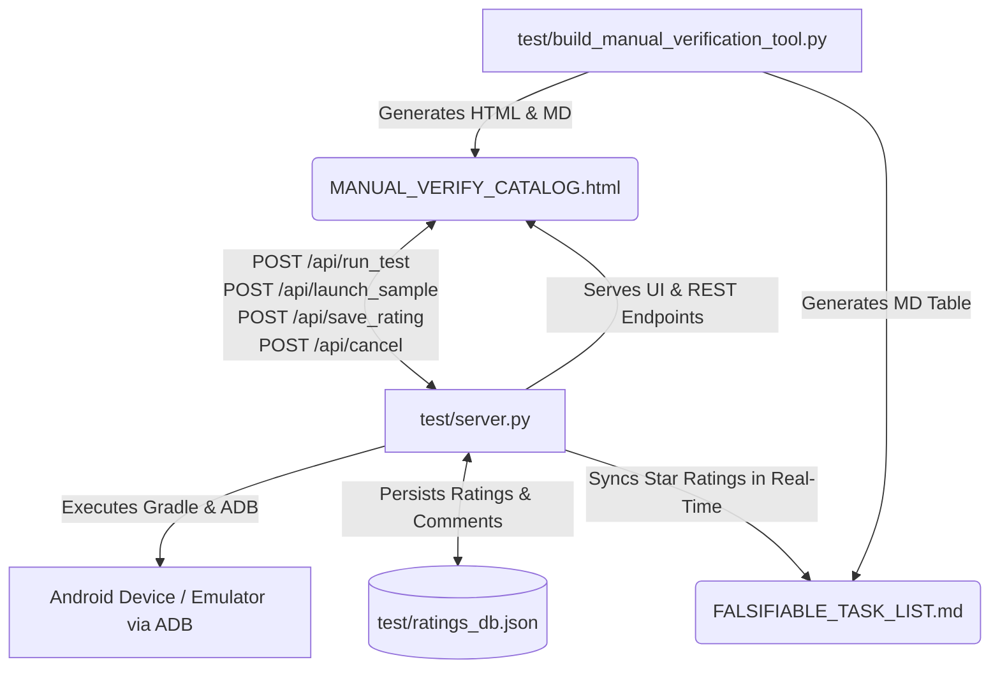

# 🗺️ Maps SDK Focused Review & Live Execution Dashboard Guide

This document is a comprehensive guide to the **Falsifiable Testing & Live Sample Verification Dashboard** (`MANUAL_VERIFY_CATALOG.html`) and its backend orchestration server (`test/server.py`). 

This tool is designed to make it effortless for human reviewers, developers, and autonomous AI agents to systematically evaluate, verify, run instrumented tests, launch interactive samples, and grade the 39 core capabilities of the Google Maps SDK for Android across both **Kotlin** and **Java**.

---

## 🏗️ Architecture & Component Overview

The verification ecosystem consists of four primary components working in synchronization:



1. **`MANUAL_VERIFY_CATALOG.html` (Frontend Dashboard UI)**
   - An interactive single-page web dashboard built with Bootstrap 5.
   - Features **Focused Mode** (step through capabilities one at a time) and **All Items Mode** (scrollable 39-item audit list).
   - Provides side-by-side **Kotlin** and **Java** code previews with interactive **▶️ Run Test** and **📱 Launch Sample** buttons for each language.
   - Features live execution terminal output boxes with **busy spinners**, **button disabling/dimming**, and **🛑 Stop / Cancel** controls.

2. **`test/server.py` (Backend API & Execution Server)**
   - A multi-threaded Python HTTP server (`http.server.ThreadingHTTPServer`) that serves `MANUAL_VERIFY_CATALOG.html` and exposes REST endpoints:
     - `POST /api/run_test`: Compiles and runs falsifiable instrumented tests on attached devices (`connectedAndroidTest`).
     - `POST /api/launch_sample`: Compiles, installs (`installDebug`), and launches (`adb shell am start`) specific sample activities.
     - `POST /api/save_rating` & `GET /api/get_ratings`: Saves 1-to-5 star evaluations and reviewer notes to `test/ratings_db.json` and updates `FALSIFIABLE_TASK_LIST.md`.
     - `POST /api/cancel`: Instantly terminates active child subprocesses (`subprocess.Popen`) and executes `./gradlew --stop` to abort long-running builds/tests.

3. **`test/build_manual_verification_tool.py` (Dashboard Generator)**
   - Reads metadata from `snippets/scripts/catalog_api.py`, discovers source files and tests, and generates `MANUAL_VERIFY_CATALOG.html` and `FALSIFIABLE_TASK_LIST.md`.

4. **`FALSIFIABLE_TASK_LIST.md` & `test/ratings_db.json` (Persistence)**
   - All reviewer ratings (`[x] 5/5 ⭐ (*great job...*)`) and comments are saved in real-time to both JSON storage and markdown checklists.

---

## 📋 Prerequisites & Environment Setup

Before launching the verification server, ensure the following setup:

### 1. ADB & Android Device/Emulator Connection
Ensure at least one physical device or emulator is connected and **authorized**:
```bash
adb devices -l
```
*Expected output (device must say `device`, not `unauthorized` or `offline`):*
```text
List of devices attached
localhost:35199        device product:oriole model:Pixel_6 device:oriole transport_id:2
```
> [!WARNING]
> If `adb devices` shows `unauthorized`, Gradle will throw `DeviceException: No online devices found` when deploying APKs. Check your device/emulator screen to accept the RSA fingerprint prompt, or restart the `adb` server using `adb kill-server && adb start-server`.

### 2. JDK & `--java-home` Flag Configuration
The backend server (`test/server.py`) invokes `./gradlew` commands to compile and execute instrumentation tests. By default, it looks for JDK 21 at `/usr/lib/jvm/java-21-openjdk-amd64`.

If your environment uses a different JDK path, specify it explicitly using the `--java-home` (or `--jdk-home`) flag:
```bash
python3 test/server.py --port 8888 --java-home /path/to/your/jdk
```
*Common available JDK paths on Google workstations:*
- `/usr/lib/jvm/java-21-openjdk-amd64` *(Default)*
- `/usr/lib/jvm/default-java`

---

## 🚀 How to Start the Server

### For Human Reviewers
Run the following command from the `comprehensive-catalog` directory in your terminal:

```bash
cd /usr/local/google/home/dkhawk/git/gmp-github/android-samples/comprehensive-catalog
python3 test/server.py --port 8888
```

Then open your web browser to:
```text
http://localhost:8888/MANUAL_VERIFY_CATALOG.html
```
*(Or if accessing remotely across machines, use your full hostname: `http://dirtdog.c.googlers.com:8888/MANUAL_VERIFY_CATALOG.html`)*

### For AI Agents & Automated Sidecars
When autonomous agents need to launch and interact with the dashboard:
1. Launch `test/server.py` in the background as an asynchronous task (e.g., using `run_command` with `WaitMsBeforeAsync: 1000`).
2. Do not poll `status` in a loop; the server runs continuously (`httpd.serve_forever()`).
3. Agents can invoke REST APIs directly via `curl` or Python requests without needing a web browser:

```bash
# Example: Launching Kotlin capability #1 sample via curl
curl -X POST http://localhost:8888/api/launch_sample \
  -H "Content-Type: application/json" \
  -d '{"group":"Map Initialization","title":"1. Basic Map Activity","lang":"kotlin"}'

# Example: Running Kotlin camera falsified test via curl
curl -X POST http://localhost:8888/api/run_test \
  -H "Content-Type: application/json" \
  -d '{"test_class":"com.example.snippets.kotlin.capabilities.CameraControlSnippetsTest","test_method":"verifyCameraMovementsAndZoomConstraints_falsifiable","lang":"kotlin"}'

# Example: Canceling an active build/test via curl
curl -X POST http://localhost:8888/api/cancel
```

---

## 🖥️ Using the Dashboard UI

Once `MANUAL_VERIFY_CATALOG.html` is open, you have full control over step-by-step verification:

| Feature | Description |
| :--- | :--- |
| **🎯 Focused Mode** | Displays exactly **1 capability at a time**, minimizing visual clutter. Use the `⬅️ Previous Item` and `Next Item ➡️` buttons to step forward or backward. |
| **⏭️ Jump to Next Requiring Attention** | Automatically scans forward and skips any capabilities that are already both **Verified** (`data-status="verified"`) and **Rated** (`⭐ 1-5 stars`), landing directly on the next item needing review. |
| **📜 All 39 Items List** | Switches to a full vertically scrollable audit report of all 39 capabilities. |
| **▶️ Run Kotlin / Java Test** | Compiles and executes the exact instrumented test class and method (`connectedAndroidTest`) on your attached device. Output streams live into the expandable terminal console. |
| **📱 Launch Sample** | Rebuilds (`installDebug`) and launches the specific interactive snippet `MapActivity` on your attached Android screen via `adb shell am start`. |
| **🔄 Busy Spinner & Disabled Buttons** | When any build or test begins, a spinning loader activates in the terminal header and **all run/launch action buttons are disabled and dimmed across the page** to prevent accidental concurrent execution conflicts. |
| **🛑 Stop / Cancel Task** | If a build or test is taking too long or you wish to abort, click **`🛑 Stop / Cancel`** in the terminal header. This immediately aborts the browser connection (`AbortController.abort()`) and signals the backend (`POST /api/cancel`) to terminate child subprocesses (`Popen.kill()`) and stop Gradle (`./gradlew --stop`). |
| **⭐ Reviewer Rating & Comments** | Click any star (1 to 5) and type critique notes in the text area. Changes are saved asynchronously and permanently recorded in `FALSIFIABLE_TASK_LIST.md`. |
| **⭐ Export Evaluation Report** | Generates a clean Markdown summary report of all evaluated capabilities and copies it to your clipboard. |

---

## 🛠️ Regenerating the Dashboard HTML

If you add new capabilities to `catalog_api.py` or modify snippet source code, rebuild `MANUAL_VERIFY_CATALOG.html` and `FALSIFIABLE_TASK_LIST.md` by running:

```bash
python3 test/build_manual_verification_tool.py
```

This regenerates both files instantly while preserving all existing star ratings and comments stored in `test/ratings_db.json`.

---

## ❓ Troubleshooting & Common Issues

### 1. `Skipping device ... Device is UNAUTHORIZED` / `No online devices found`
- **Cause**: The Android device or emulator has not completed its RSA key confirmation handshake or is disconnected.
- **Fix**: Run `adb devices -l`. If it says `unauthorized`, unlock the physical device or check the emulator display and tap **Allow USB Debugging**. If frozen, run `adb kill-server && adb start-server`.

### 2. `Address already in use (Port 8888)`
- **Cause**: Another instance of `test/server.py` or another local process is listening on port `8888`.
- **Fix**: Check what process is using the port:
  ```bash
  lsof -i :8888
  ```
  Kill the old process (`kill -9 <PID>`) or launch the server on a different port (`python3 test/server.py --port 8889`).

### 3. Gradle build errors due to Java incompatibility
- **Cause**: System default `java` does not match Gradle 8.x/9.x requirements.
- **Fix**: Pass the explicit JDK 21 path when starting the server:
  ```bash
  python3 test/server.py --port 8888 --java-home /usr/lib/jvm/java-21-openjdk-amd64
  ```

### 4. Need to force stop a stuck Gradle daemon outside the UI
If a Gradle task hangs completely and the UI cancel button cannot reach the daemon, terminate all Gradle daemons manually:
```bash
./gradlew --stop
# or forcefully:
pkill -9 -f GradleDaemon
```
